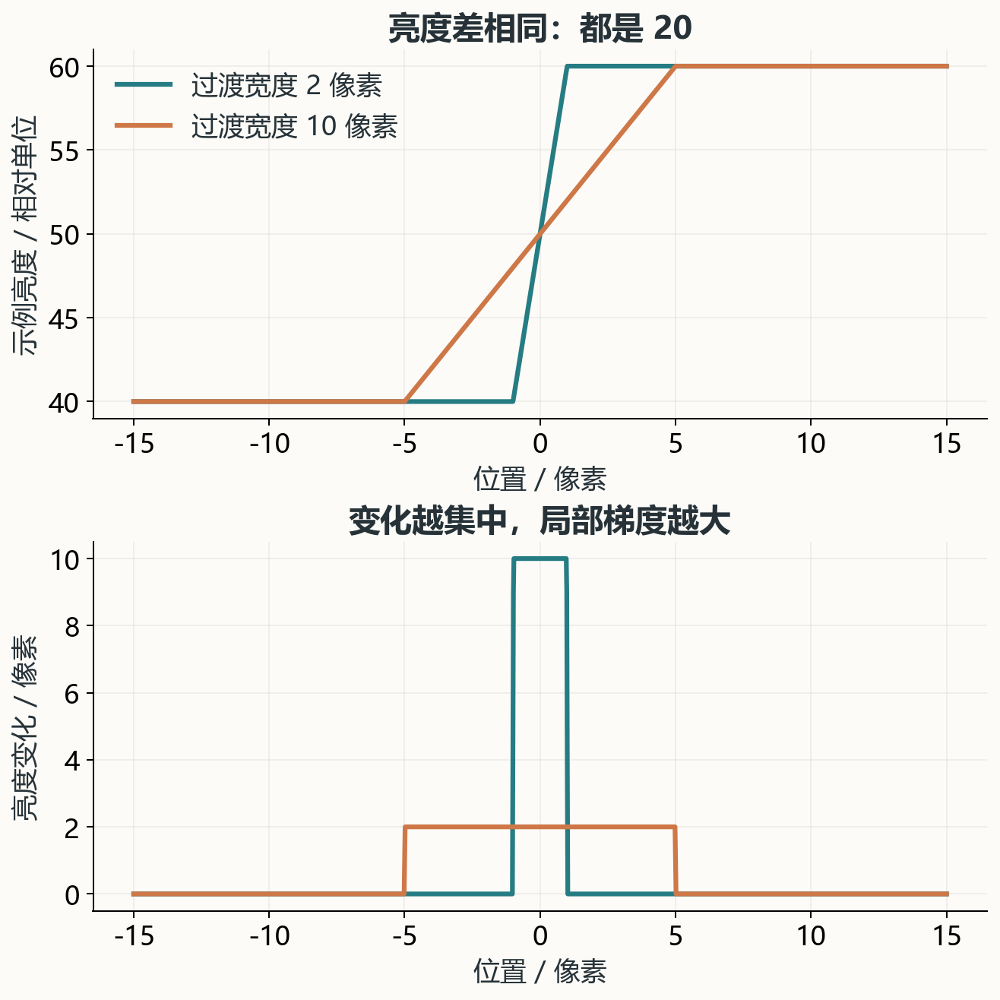
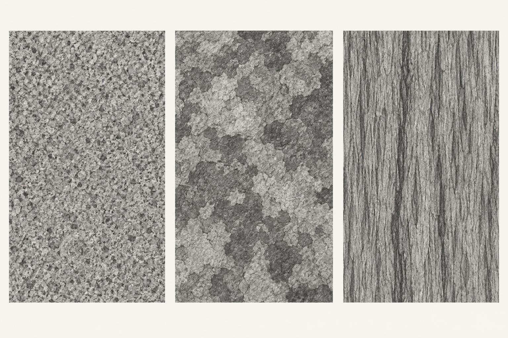
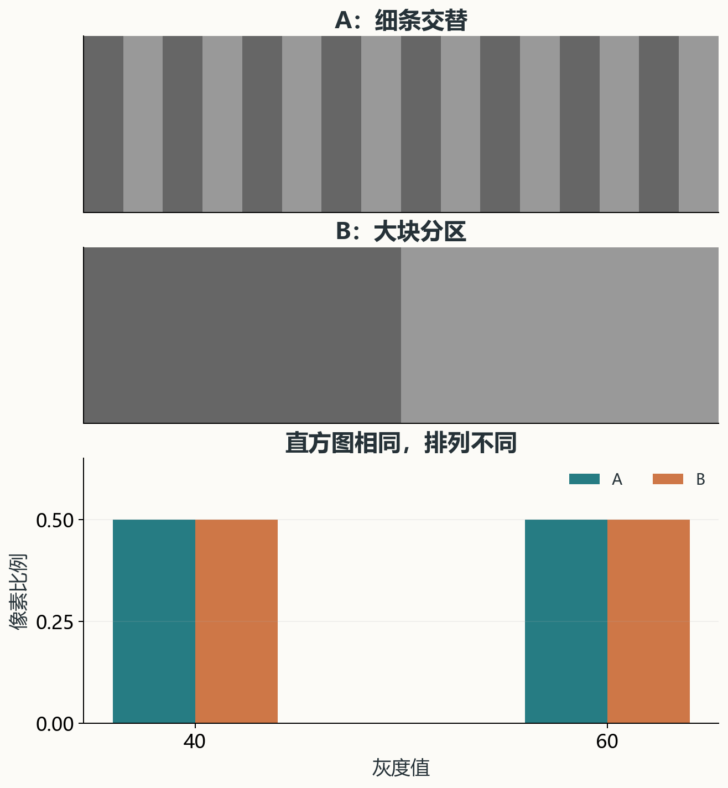
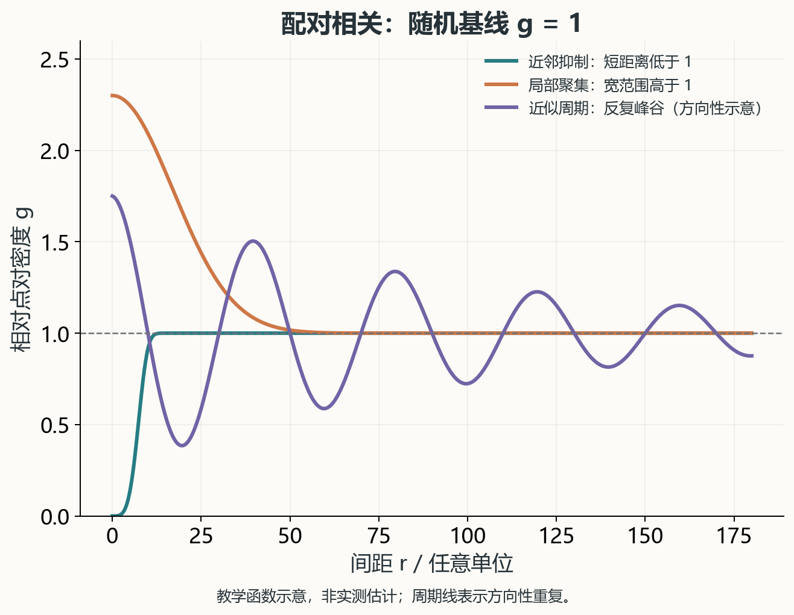
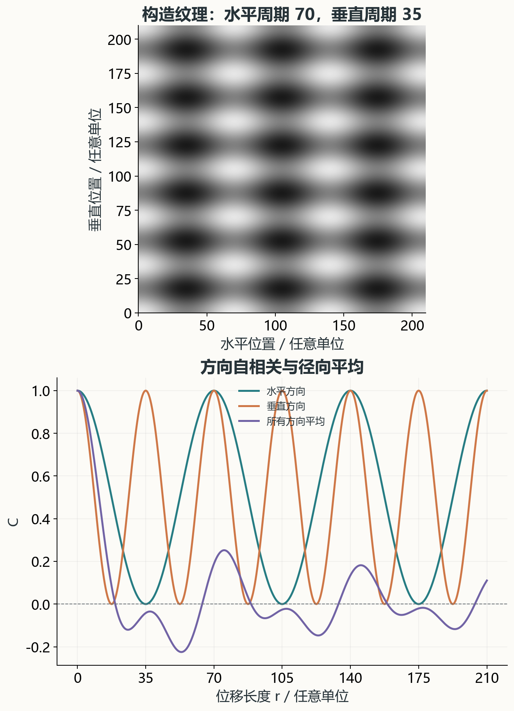
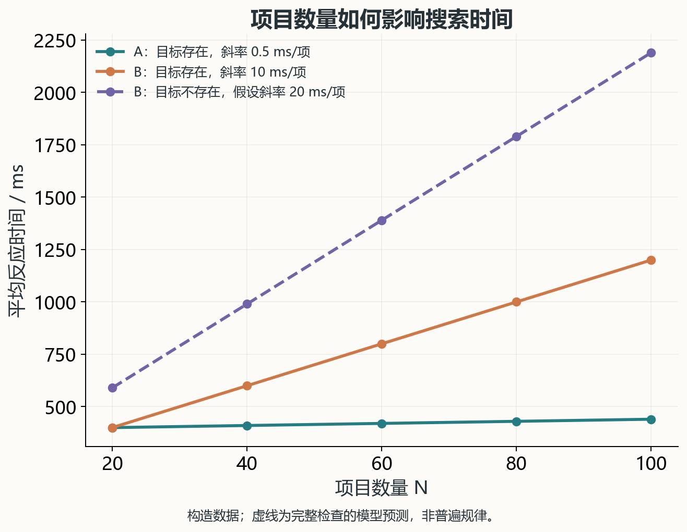
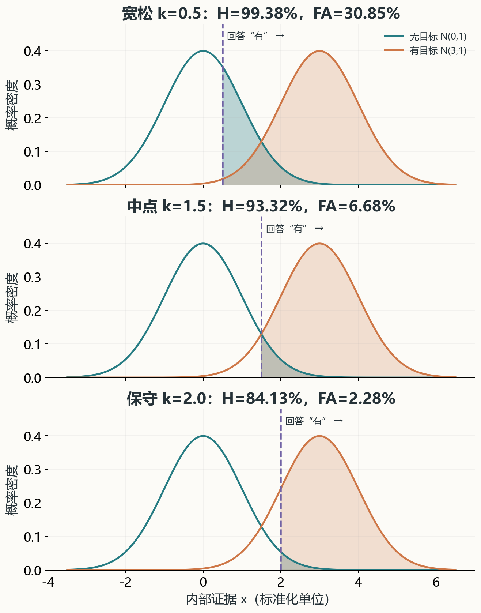
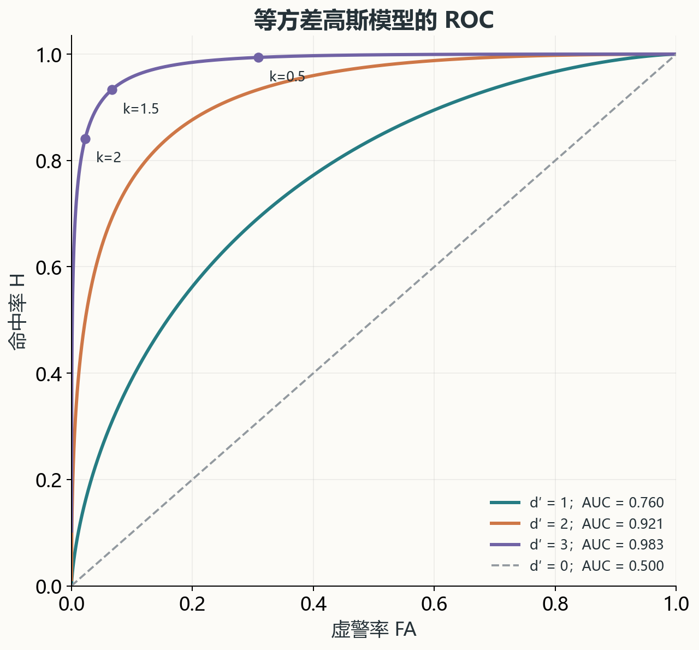

一个灰色箱子放在灰墙前，即使两者颜色接近，我们仍然可能很快看见它。把视线移远，墙上的细裂纹逐渐难以辨认，箱体的大轮廓却还在。换一个纹理更复杂的背景，第一次扫视可能忽略它，但如果事先知道要找一个矩形物体，又可能很快找到。

这些现象指向同一个问题：**“被看见”并非物体的一项固定属性，而是目标、背景、成像与观察条件、注意任务共同作用的结果**。

理解伪装遮障，需要先理解这条过程：图像里有什么差异，哪些差异能被感知，哪些线索引导搜索，观察者又依据什么作出“有目标”的判断。本篇从可见光条件下的人眼视觉出发，把这几个层次连起来。红外、雷达等探测方式具有不同的物理与成像机制，不能直接套用这里的人眼视觉结论。

文章分为三个递进层次：先用对比、边缘和尺度解释“有哪些可见线索”；再用纹理统计与空间相关解释“背景具有怎样的结构”；最后用视觉搜索和信号检测解释“如何从线索走到判断”。公式都配有变量说明与数值例子，可以沿着图示读直觉，也可以逐步复算。

:::note[阅读路线]

- 第 1—3 节：理解对比、边缘和观察尺度，建立视觉直觉。
- 第 4—6 节：用统计量区分灰度分布与空间结构，重点看图 4 和图 6。
- 第 7—10 节：把图像线索接到搜索与判断，逐步复算命中、虚警和 ROC。
- 第 11—12 节：整理研究方法，并用文末自测检查理解。

:::

## 1. 颜色相近，为什么仍然会显眼？

*图 1：灰色箱子与灰墙。生成插图用于展示不同视觉线索，不是经过颜色标定的对照实验。*

观察这个箱子，我们并非只比较“箱子是什么颜色、墙是什么颜色”。连续的边缘帮助我们组织出形状；箱面与墙面的纹理差异帮助我们划分区域；投影和不同面的明暗提供空间结构线索。多种信息可能共同支持“这里有一个独立物体”的判断。

背景匹配与破坏性着色在视觉伪装研究中是不同但可能并存的机制：前者关注外观与背景的相似性，后者涉及形状和边界的感知。这个区分说明，颜色相似不能包办物体从背景中分离出来的全过程。[Stevens 与 Merilaita，2009](https://pmc.ncbi.nlm.nih.gov/articles/PMC2674078/)

### 1.1 八类线索，分别在回答什么？

| 线索 | 主要关注的差异 | 容易混淆之处 |
| --- | --- | --- |
| 颜色 | 色调、饱和度等相对于背景的差异 | 同为“绿色”或“灰色”不代表颜色完全相同。 |
| 明暗 | 区域亮度及其与邻域的对比 | 涂料颜色相同，受光后也可能具有不同明暗。 |
| 轮廓 | 边界连续性、曲率、转角与整体形状 | 规则形状是否突出，取决于背景是否也有相似结构。 |
| 纹理 | 斑块尺度、疏密、方向及排列关系 | 平均颜色相同，纹理仍可能完全不同。 |
| 阴影 | 自身明暗与投射到邻近表面的暗区 | 阴影既改变对比，也可能提供体积与接触关系。 |
| 反光 | 局部高光、闪点及随视角变化的亮区 | 反光突出不等于整个物体都更亮。 |
| 位置关系 | 物体与地面、邻近物及场景结构的关系 | 场景预期可能帮助搜索，不能只看局部像素。 |
| 动态变化 | 位移、晃动、闪烁和其他时间变化 | 静态截图没有包含动态信息。 |

这八项适合作为观察清单，不能直接相加成“暴露分数”。阴影会改变明暗边缘，反光也是亮度变化，轮廓往往又由颜色或纹理边界体现，它们之间存在重叠。

例如，一个金属箱是否显得更亮，要结合涂层、表面粗糙度、朝向与光照判断。“金属”是材料名称，“画面中的高光”是具体观察结果，两者之间不能省略成像条件。

### 1.2 先区分发现、定位与识别

“看见目标”还可能对应不同任务：

- **发现**：画面里是否存在需要关注的目标？
- **定位**：目标在什么位置？
- **识别**：这个物体是什么，属于哪一类？

一个暗斑可能引起注意，却不足以识别为箱子；知道某处有东西，也不等于能分清它的类别。讨论效果时，应先明确测量的是哪一环节。

## 2. 差异有多大，与变化有多突然

“这个物体和背景不一样”仍然过于笼统。至少还要追问两件事：差异的幅度有多大？差异集中在多窄的区域内发生？

### 2.1 用对比度描述相对差异

对较均匀背景上的小目标，一个简单描述是 Weber 对比度：

$$
C_W=\frac{L_t-L_b}{L_b}
$$

其中 $L_t$ 为目标亮度，$L_b$ 为背景亮度，且 $L_b>0$。例如背景为 $50$、目标为 $60$，则：

$$
C_W=\frac{60-50}{50}=0.20
$$

目标相对背景亮了 20%。若目标亮度为 $40$，则 $C_W=-0.20$，负号表示目标比背景暗。这个数描述相对亮度差，并不是“20% 的发现概率”。

对于明暗交替的周期条纹，更常用 Michelson 对比度：

$$
C_M=\frac{L_{\max}-L_{\min}}{L_{\max}+L_{\min}}
$$

若条纹亮、暗部分分别为 $60$ 和 $40$，则 $C_M=0.20$。两种公式回答的问题不同，不能只因算出了同一个数，就认为刺激在视觉上等价。上述对比度定义及其与空间频率的关系，可参见纽约大学的视觉感知讲义。[Spatial Frequency Channels](https://www.cns.nyu.edu/~david/courses/perception/outlines/outline-channels.html)

这里的 $L$ 指光度意义上的亮度。普通图片中的 RGB 或灰度编码值通常经过非线性编码，不能未经处理就当作物理亮度。下面涉及灰度数组的例子，只用于数学演示。

### 2.2 同样的亮度差，可以形成不同的边缘

假设亮度都从 $40$ 变为 $60$。一种变化在 2 个像素内完成，另一种在 10 个像素内完成。在线性过渡的简化模型里：

$$
\left|\frac{\Delta L}{\Delta x}\right|
=
\begin{cases}
20/2=10, & \text{窄过渡}\\
20/10=2, & \text{宽过渡}
\end{cases}
$$

二者端点的亮度差相同，但前者变化更集中，局部梯度更大。

*图 2：按上述线性模型计算的示例。上图比较亮度剖面，下图比较每像素的变化量；不表示测得的人眼响应。*

二维图像可以用梯度幅值表达这个想法：

$$
|\nabla L|
=
\sqrt{
\left(\frac{\partial L}{\partial x}\right)^2+
\left(\frac{\partial L}{\partial y}\right)^2
}
$$

不过，“梯度大”不等于“必然先被发现”。如果整个背景都充满强边缘，一个局部强边缘未必独特。边缘还要经过成像模糊、视觉分辨与背景比较，才能成为有效线索。

### 2.3 纹理边界可以不伴随平均亮度变化

想象画面左半边由竖线组成，右半边由横线组成，两侧平均灰度与明暗比例相同。即使没有大块亮度跳变，我们仍可能把它们分成两个区域。

亮度边缘直接体现为 $L(x,y)$ 的变化；方向边界则体现在局部方向分布的变化。描述后者时，往往需要先提取不同方向的响应，再比较这些响应的局部强弱。

方向定义的纹理边界已有专门的心理物理研究，说明即使平均亮度不是区域区分的主要线索，局部方向组织仍能支持边界判断。[Wolfson 与 Landy，1995](https://www.cns.nyu.edu/~msl/papers/wolfsonlandy95.pdf)

因此，纹理方向边界常被放在“二阶”纹理处理的语境下讨论。这里的“二阶”不是简单把亮度求两次导数，而是指经过滤波、整流或能量计算后再分析结构。多尺度、不同方向的滤波响应及其联合统计，是纹理建模的一条重要路线。[Portilla 与 Simoncelli，2000](https://www.cns.nyu.edu/~lcv/texture/)

## 3. 距离改变的，其实是可用信息的尺度

同样大小的图案，离观察者越远，在视野里占据的角度越小。设目标尺度所在平面垂直于视线，视线指向该尺度的中点；用横向尺寸 $s$ 和到中点的距离 $D$ 表示，其视角为：

$$
\alpha=2\arctan\left(\frac{s}{2D}\right)
$$

当 $s\ll D$ 时，弧度制下近似为 $\alpha\approx s/D$。

例如，1 cm 宽的纹理在 1 m 处约占 $0.573^\circ$，在 10 m 处约占 $0.0573^\circ$。距离增加十倍，纹理的角尺度约缩小为十分之一。是否还能分辨，还要看对比、视觉能力、光照等条件，不能单凭视角给出统一答案。

### 3.1 空间频率：单位视角内变化多少次？

空间频率可以理解为图像中明暗变化的密集程度，视觉研究常使用“周期/度”。粗大条纹对应较低空间频率，细密条纹对应较高空间频率。

对同一组物理条纹，距离增大后，更多周期被压进一度视角内，其角空间频率升高。若这些细节超出当前条件下的分辨能力，明暗细条可能融合为较均匀的区域。观察距离与观察者的视觉分辨能力，因而会改变同一图案的外观。[Stevens 与 Merilaita，2009](https://pmc.ncbi.nlm.nih.gov/articles/PMC2674078/)

人眼对不同空间频率的敏感度也并不相同。对比敏感度函数（CSF）描述检测正弦条纹所需对比阈值的倒数随空间频率如何变化。在典型明视觉条件下，它常呈带通形状：中间一段频率较敏感，两端较低；亮度、偏心度等条件变化时，曲线也会变化。因此，“频率越低越容易看见”同样不是通则。[NYU 视觉感知讲义](https://www.cns.nyu.edu/~msl/courses/0022X/lecturenotes/channels/channels.html)

用图像处理作类比，可以将某一尺度下的图像写成：

$$
L_\sigma=G_\sigma*L
$$

其中 $G_\sigma$ 为高斯核，$*$ 表示卷积。随着模糊尺度 $\sigma$ 增大，细小变化会被平滑。这是理解尺度筛选的模型，不是对真实远距离观察的完整模拟。

### 3.2 为什么“细节像”与“整体像”可以同时成立或冲突？

设两个区域都由同样大小、同样深浅的小斑点组成：

- 区域 A 的斑点均匀分散。
- 区域 B 的斑点集中在几个大团内。

近看，单个斑点相似；稍微缩小，B 的大团块却可能更加突出。再继续缩小，两者可能只剩下整体明暗差，或者最终都无法分开。

这说明至少要区分：

| 尺度 | 主要观察对象 | 可能出现的差异 |
| --- | --- | --- |
| 小尺度 | 颗粒、短线、局部边缘 | 元素大小、粗糙程度、细部方向 |
| 中尺度 | 斑块、局部群组 | 聚集范围、局部密度、斑块形状 |
| 大尺度 | 整体轮廓与明暗布局 | 连续外边界、大范围疏密变化 |

不能预先规定“纹理、反光、轮廓、阴影”必然按某个顺序消失。一个小而强的亮点可能仍可被检测，却无法分辨其形状；一个面积很大的弱对比结构，也可能早已难以察觉。**检测到存在与分辨出细节，是两件不同的事**。

## 4. 纹理统计：平均值为什么远远不够？

*图 3：三种纹理具有不同尺度与方向结构。生成插图用于概念比较，平均亮度和对比度没有严格匹配。*

“灰色背景”只说明了非常粗略的外观。要理解背景内部结构，可以从均值、方差走向位置之间的关系。

### 4.1 均值与方差描述了什么，又丢掉了什么？

对 $n$ 个灰度值 $I_i$，这里用总体形式计算：

$$
\begin{aligned}
\mu&=\frac{1}{n}\sum_{i=1}^{n}I_i\\
\sigma^2&=\frac{1}{n}\sum_{i=1}^{n}(I_i-\mu)^2
\end{aligned}
$$

均值描述平均灰度，方差描述灰度围绕平均值的波动程度。但它们都不关心像素的排列顺序。

看两个一维纹理：

$$
A=[40,60,40,60,40,60,40,60]
$$

$$
B=[40,40,40,40,60,60,60,60]
$$

二者均值均为 $50$，方差均为 $100$，直方图也完全相同。A 却是高频交替，B 是两个大块区域。如果只记录均值、方差甚至整张直方图，这种差异都会被遗漏。

从这个例子可以直接推出：**像素取值的分布，不等于像素在空间中的组织方式**。

*图 4：程序构造的严格对照。两幅图各有一半像素取 40、一半取 60，均值均为 50、总体方差均为 100；差别只在空间排列。与图 3 的概念插图不同，这里的统计量经过精确匹配。*

### 4.2 局部密度与排列关系也不同

在一个区域里数到 100 个点，只知道总数量；把区域分成小格、逐格统计数量，增加了局部密度信息。但是，即使每格点数相同，点仍可能贴近格子中心、沿着某个方向排列，或者彼此保持间隔。

所以，“每个窗口里有多少点”和“点之间相隔多远、朝什么方向排列”需要分别描述。后一个问题引出空间相关。

## 5. 空间相关：排斥、聚集与周期怎样体现在曲线上？

### 5.1 先确定分析对象：点，还是连续灰度？

如果分析斑点中心的位置，可以把纹理抽象为点模式。如果分析每个像素的灰度，则是在分析一个连续或离散的标量场。两者都可以研究空间关系，但定义、基线与解释并不相同。

对平均密度为 $\lambda$、近似平稳且各向同性的二维点模式，配对相关函数 $g(r)$ 描述：已知有一个点，在距离它约为 $r$ 的位置，其他点相对于同密度独立泊松过程是更多还是更少。其标准随机基线为 1。[Baddeley、Rubak 与 Turner，空间相关章节](https://book.spatstat.org/sample-chapters/chapter07.pdf)

直观地，以某个点为中心画一个半径 $r$、厚度 $\mathrm{d}r$ 的薄圆环。圆环面积近似为 $2\pi r\,\mathrm{d}r$，所以：

$$
m(r,\mathrm dr)
\approx
\lambda\,g(r)\,2\pi r\,\mathrm{d}r
$$

其中 $m$ 表示以一个典型点为中心时，薄圆环内其他点数的条件期望。这也说明为什么不能只数“某个距离上的点对”：半径越大，圆环本来就越大，必须做几何面积和密度归一化。

### 5.2 读懂随机基线、峰与谷

| 曲线特征 | 直接含义 | 可以提出的结构解释 |
| --- | --- | --- |
| $g(r)<1$ | 该间距的点对比基线少 | 这一尺度存在抑制或排斥 |
| $g(r)>1$ | 该间距的点对比基线多 | 这一尺度存在聚集或偏好的间隔 |
| $g(r)\approx1$ | 二阶点对关系接近基线 | 没有明显的该尺度点对偏离 |
| 一段较宽的隆起 | 一段间距范围内点对持续偏多 | 可能存在有限范围聚集 |
| 多个重复峰 | 多组特定间距反复出现 | 可能存在周期或准周期结构 |

*图 5：教学函数示意，非实测估计。周期线表示方向性重复的直觉；二维点阵的径向距离还可能包含对角线间距，不能统一按整数倍周期解释。*

假设观察到小间距内 $g(r)$ 接近 0，中等间距内出现宽峰，更大间距又出现数个重复峰。一个可检验的解释是：点之间有最小间隔，点又组成局部群组，而群组之间存在近似重复排列。

重复峰逐渐变低、变宽，可能提示重复结构的相位或间距一致性随范围扩大而减弱。例如，间隔误差逐段积累时，远距离重复的位置会更不确定。但这不是所有带随机扰动的周期结构必有的形状：独立位置抖动、累积间距误差与有限观察窗口，产生的结果并不相同。

这里的关键词是“可检验的解释”。**相关曲线不是纹理的唯一指纹，同一类峰谷并不能唯一还原生成机制**。应结合原始图像、方向性和其他统计量判断。

随机也不等于视觉上绝对均匀。独立随机布点会自然产生局部拥挤与空隙；反而“每个点都尽量与邻点等距”的排列通常具有抑制结构。另一个需要保留的限制是：$g(r)=1$ 只说明这个二阶统计量没有偏离泊松基线，不能单独证明全部高阶关系都独立。

实际估计还要处理边界截断和空间密度变化。图像边缘的点缺少可观察邻域；如果背景左侧本来比右侧密，把整体视作同一密度也可能误判聚集。

### 5.3 灰度自相关的基线为什么不同？

对平稳灰度场，要求方差有限且 $\sigma^2>0$。记位置为 $\mathbf r=(x,y)$、位移为 $\boldsymbol\delta=(\Delta x,\Delta y)$，并令 $J(\mathbf r)=I(\mathbf r)-\mu$，可定义归一化自协方差：

$
C(\boldsymbol\delta)=
\frac{\mathbb E[J(\mathbf r)J(\mathbf r+\boldsymbol\delta)]}{\sigma^2}
$

它也常被称为归一化自相关，本文使用上述减去均值的定义。

- 零位移时，同一个数与自己比较，$C(0,0)=1$。
- 正值表示相隔该位移的灰度偏差倾向于同号。
- 负值表示一个偏亮时，另一个倾向于偏暗。
- 接近 0 表示没有明显的线性协方差，不保证独立。

:::tip[先认清相关曲线的基线]

它与点模式 $g(r)$ 的区别非常明确：**这里无协方差的基线是 0；点模式的泊松基线是 1**。读图前必须先看定义，不能只凭“相关”二字套用解释。

:::

## 6. 各向异性：为什么平均以后，结构反而不明显？

纹理可能沿水平方向每隔 70 个单位重复，沿垂直方向每隔 35 个单位重复。只问“距离多远”会丢失一半问题，还需要问“沿哪个方向”。

### 6.1 一个可以直接算出的二维例子

构造如下灰度纹理：

$$
\begin{aligned}
I(x,y)={}&0.5+0.2\cos(2\pi x/70)\\
&+0.2\cos(2\pi y/35)
\end{aligned}
$$

其平均灰度为 $0.5$，水平周期为 70，垂直周期为 35。对完整周期作空间平均，或者令两个相位独立均匀随机，可以得到：

$$
\begin{aligned}
C(\Delta x,\Delta y)
={}&\tfrac12\cos(2\pi\Delta x/70)\\
&+\tfrac12\cos(2\pi\Delta y/35)
\end{aligned}
$$

因此，纯水平位移与纯垂直位移分别给出：

$$
C_x(r)=\frac{1}{2}\left[\cos(2\pi r/70)+1\right]
$$

$$
C_y(r)=\frac{1}{2}\left[1+\cos(2\pi r/35)\right]
$$

注意其中的常数项：沿水平方向移动，垂直那一组条纹并未改变，所以不能把整个二维纹理的水平相关直接写成单独一个余弦。

| 位移 $r$ | 水平相关 $C_x(r)$ | 垂直相关 $C_y(r)$ |
| --- | ---: | ---: |
| 35 | 0 | 1 |
| 70 | 1 | 1 |
| 105 | 0 | 1 |
| 140 | 1 | 1 |
| 210 | 1 | 1 |

*图 6：上方为构造纹理，下方按解析式绘制方向相关，并对完整角域数值积分计算径向平均。它说明方向信息如何在平均中丢失。*

### 6.2 径向平均平均的是所有方向

对于灰度相关，径向平均为：

$$
\overline C(r)=
\frac{1}{2\pi}
\int_0^{2\pi}
C(r\cos\theta,r\sin\theta)\,\mathrm d\theta
$$

点模式的方向配对相关 $g(r,\theta)$ 也可以同样作角度平均。这里平均的是整个圆周，不是只取水平与垂直两个值相加除以二。方向配对相关与旋转平均的正式定义，可参见空间点模式教材的各向异性章节。[Baddeley、Rubak 与 Turner](https://book.spatstat.org/sample-chapters/chapter07.pdf)

在 $r=70$ 时，图 6 的水平和垂直相关都达到 1，其他角度却未必处于相同的周期位置，因此平均后不会仍然是 1。

进一步考虑一个简化角域算例。设某个距离上，$g=2.5$ 只出现在两个相反方向附近，每个方向覆盖 $10^\circ$，总共 $20^\circ$；其余角度为 1，则：

$$
\overline g_A
=
1+(2.5-1)\frac{20}{360}
\approx1.083
$$

另一种纹理峰值只有 $1.7$，却在两个方向上各覆盖 $70^\circ$，总共 $140^\circ$：

$$
\overline g_B
=
1+(1.7-1)\frac{140}{360}
\approx1.272
$$

A 的方向峰更高，B 的径向平均却更高。两者描述的并不是同一件事：前者强调最强方向，后者还取决于角度覆盖范围。如果部分方向高于基线、另一些低于基线，还会发生偏离量的部分抵消。

因此，平均曲线平坦不能证明所有方向都缺少结构。相关统计也不能完整决定纹理外观：已有纹理研究展示了低阶统计相同而视觉上仍可区别的情况。[Portilla 与 Simoncelli，纹理表征资料](https://www.cns.nyu.edu/~lcv/texture/)

## 7. 视觉显著性与搜索：有差异，为什么不一定先被发现？

到这里，我们讨论的主要是图像结构。但图像有差异，与观察者把注意放到那里，并不完全等价。

一个方向异常出现在高度一致的条纹背景里，可能很突出；放进包含许多方向的背景，同样的异常就未必独特。背景复杂度不能只用“元素多”概括，还应考虑目标与干扰项的相似性、干扰项之间的差异及当前任务。

视觉搜索既可受到刺激特征引导，也可受到搜索目标引导。知道要找“蓝色椭圆”，就能利用颜色、形状等信息限制候选位置。这种任务引导说明，搜索不是被动地等待最显眼的物体获胜。[Wolfe，2010](https://pmc.ncbi.nlm.nih.gov/articles/PMC5678963/)

这里还应区分“显著性”与“搜索优先级”：前者通常强调刺激相对于周围的突出程度；实际先看哪里，还受到任务目标、过去经验、奖励和场景知识影响。Guided Search 6.0 将这些来源共同纳入注意引导，因此不能把一张显著性图当作完整的搜索过程。[Wolfe，2021](https://pmc.ncbi.nlm.nih.gov/articles/PMC8965574/)

### 7.1 跳出搜索与困难搜索

在一组相似灰点中找唯一红点，目标有一个较独特的特征；在红方块与蓝圆组成的干扰项中找红圆，则可能需要进一步筛选。二者可以作为高效与低效搜索的直观例子，但不能把“单一特征”与“并行”、“组合特征”与“完全串行”机械画等号。

“多一个特征”和“少一个特征”也可能不对称。例如在圆圈中找带一条短尾巴的圆圈，与在许多带尾巴圆圈中找唯一没尾巴的圆圈，目标与背景交换后，独特线索的形式已经改变。一个问题要求检测某个局部结构的存在，另一个要求确认其缺失；具体表现要通过任务测量，而不能仅凭两种形状的差异量推断完全相同的难度。经典的圆圈与带相交线圆圈实验直接展示了这种搜索不对称。[Treisman 与 Souther，1985](https://pubmed.ncbi.nlm.nih.gov/3161978/)

### 7.2 搜索斜率把“更费时间”变成可比较的量

对一定范围内的项目数量 $N$，用线性近似描述平均反应时间：

$$
RT(N)\approx a+bN
$$

$a$ 为截距，$b$ 为搜索斜率，单位可写成 ms/项。

构造两组示例数据：

| 任务 | 20 项时 | 100 项时 | 平均斜率 |
| --- | ---: | ---: | ---: |
| A | 400 ms | 440 ms | $(440-400)/80=0.5$ ms/项 |
| B | 400 ms | 1200 ms | $(1200-400)/80=10$ ms/项 |

在这组数据里，增加项目数量明显拖慢 B，对 A 的影响较小。这比只说“B 用了 1200 ms”更能说明搜索如何受到数量影响。

*图 7：构造数据，用于解释斜率与截距。不是实测结果，也不是不同场景必须遵循的固定数值。*

斜率是反应时间随数量变化的速度。只有在另外证实了相应处理机制时，才可以把它解释成“检查一个项目需要的时间”；反应时间曲线本身不能独立证明串行或并行机制。[Wolfe，2010](https://pmc.ncbi.nlm.nih.gov/articles/PMC5678963/)

### 7.3 为什么“没有目标”有时更慢？

在一个理想的串行、自终止模型里，如果目标等概率出现在各位置，有目标时平均检查约 $(N+1)/2$ 项就能停止；没有目标时则要检查全部 $N$ 项。因此，目标不存在时的斜率可以接近目标存在时的两倍。

图 7 的理想串行示例取每项检查 20 ms、共同额外耗时 190 ms，因此有目标时为 $190+20(N+1)/2=200+10N$，无目标时为 $190+20N$；两倍关系针对斜率，不能直接套到总反应时间。

这是模型预测，不是普遍定律。现实观察者可能提前停止，也可能反复查看；有的任务能快速排除整片区域。更快作答还可能伴随更多漏检，所以搜索时间必须与准确性一起看。

## 8. 信号检测：把“看得清”与“愿意说有”分开

设一个实验让观察者判断噪声图像中是否出现淡圆形。有些试次有圆，有些没有。观察者每次回答“有”或“没有”，会形成四种结果：

| 实际情况 | 回答“有” | 回答“没有” |
| --- | --- | --- |
| 有目标 | 命中（hit） | 漏检（miss） |
| 无目标 | 虚警（false alarm） | 正确拒绝（correct rejection） |

定义命中率 $H$ 与虚警率 $FA$：

$$
\begin{aligned}
H&=\frac{\text{命中次数}}{\text{有目标试次数}}\\
FA&=\frac{\text{虚警次数}}{\text{无目标试次数}}
\end{aligned}
$$

分母不同。例如 100 次有目标试次中命中 85 次、100 次无目标试次中误报 20 次，则 $H=0.85$、$FA=0.20$。虚警率不是所有“回答有”中错误回答的比例；后者是另一个条件概率。

只看命中率会产生明显漏洞：一个人每次都回答“有”，可以达到 100% 命中，但同时也有 100% 虚警。信号检测理论通过区分证据分布与判断标准，分析这种差异。[Heeger，Signal Detection Theory](https://www.cns.nyu.edu/~david/handouts/sdt/sdt.html)

### 8.1 内部证据并非“有”和“无”两种固定值

噪声中的偶然结构可能让人觉得“像有一个圆”；真正有圆时，也可能因为对比很弱或注意不足而证据不强。于是，同一种条件下的内部证据 $X$ 会波动。

接下来采用**等方差高斯模型**：

$$
\begin{aligned}
X\mid N&\sim\mathcal N(\mu_N,\sigma^2)\\
X\mid S&\sim\mathcal N(\mu_S,\sigma^2)
\end{aligned}
$$

$N$ 表示无目标条件，$S$ 表示有目标条件；有目标条件同样含噪声。两类分布的均值分别是 $\mu_N$、$\mu_S$，共同标准差为 $\sigma$。

观察者采用证据阈值 $k$：若 $X>k$，回答“有”。于是：

$$
FA=1-\Phi\left(\frac{k-\mu_N}{\sigma}\right)
$$

$$
H=1-\Phi\left(\frac{k-\mu_S}{\sigma}\right)
$$

$\Phi$ 是标准正态分布的累积分布函数。两个式子都对应判断线右侧的曲线下面积。

### 8.2 敏感度 $d'$：两类证据分开多远？

模型中的敏感度定义为：

$$
d'=\frac{\mu_S-\mu_N}{\sigma}
$$

它是用共同标准差归一化后的均值差。均值相距越远，或者相同均值差下分布越窄，两类证据通常越容易区分。

令 $Z=\Phi^{-1}$，利用正态分布对称性可得：

$$
\begin{aligned}
Z(H)&=\frac{\mu_S-k}{\sigma}\\
Z(FA)&=\frac{\mu_N-k}{\sigma}
\end{aligned}
$$

相减后，阈值 $k$ 消去：

$$
\boxed{d'=Z(H)-Z(FA)}
$$

这就是用命中率和虚警率估计 $d'$ 的由来。两项不是直接相减的百分数，而是先转成标准正态分位数。常用敏感度与偏向指标的定义及计算问题，可参见 Stanislaw 与 Todorov 的方法论文。[Stanislaw 与 Todorov，1999](https://doi.org/10.3758/BF03207704)

以 $H\approx0.8413$、$FA\approx0.1587$ 为例：

$$
Z(0.8413)\approx1,\qquad Z(0.1587)\approx-1
$$

所以 $d'\approx1-(-1)=2$，不是 $0.8413-0.1587$。

### 8.3 同一能力，不同标准：完整算一次

设无目标分布为 $\mathcal N(0,1)$，有目标分布为 $\mathcal N(3,1)$，则 $d'=3$。此时：

$$
FA=\Phi(-k),\qquad H=\Phi(3-k)
$$

| 阈值 $k$ | 命中率 $H$ | 虚警率 $FA$ | $Z(H)$ | $Z(FA)$ | $d'$ |
| --- | ---: | ---: | ---: | ---: | ---: |
| 0.5 | 99.38% | 30.85% | 2.5 | −0.5 | 3 |
| 1.0 | 97.72% | 15.87% | 2.0 | −1.0 | 3 |
| 1.5 | 93.32% | 6.68% | 1.5 | −1.5 | 3 |
| 2.0 | 84.13% | 2.28% | 1.0 | −2.0 | 3 |

*图 8：两条分布保持不变，判断线逐渐右移。阴影分别表示两类分布中回答“有”的面积；纵轴是概率密度，不是命中率。*

阈值从 0.5 提高到 2.0，命中率与虚警率都下降，但两分布没有变化，$d'$ 始终为 3。这正是“判断更严格”与“感知更敏锐”的区别。

### 8.4 判断偏向 $c$ 与似然比 $\beta$

常用判断偏向指标为：

$$
\begin{aligned}
c&=-\frac{Z(H)+Z(FA)}{2}\\
&=\frac{k-(\mu_S+\mu_N)/2}{\sigma}
\end{aligned}
$$

这里将实际阈值记为 $k$，把标准化后的偏向记为 $c$，避免混用。

- $c<0$：阈值位于两均值中点左侧，相对宽松。
- $c=0$：阈值位于中点。
- $c>0$：阈值位于中点右侧，相对保守。

另一种表达是阈值处的信号与噪声密度比：

$$
\beta=\frac{f_S(k)}{f_N(k)}
=\exp(d'c)
$$

最后一步依赖当前的等方差高斯模型。

| $k$ | $c=k-1.5$ | $\beta=e^{3c}$ | 相对判断偏向 |
| --- | ---: | ---: | --- |
| 0.5 | −1.0 | 0.0498 | 宽松 |
| 1.0 | −0.5 | 0.2231 | 较宽松 |
| 1.5 | 0 | 1 | 中点 |
| 2.0 | 0.5 | 4.4817 | 保守 |

$k=1.5$ 比 $0.5$ 更严格，但它仍是中点标准。对于这个模型，当先验概率和两类错误代价对称时，中点也是最小错误率标准；目标稀少或漏检代价更高时，最优阈值未必在中点。

### 8.5 $d'$ 不是一项脱离条件的“眼力分数”

$d'$ 描述的是特定实验条件下的区分表现。刺激对比、噪声、注意、观看时间、目标位置是否已知，都可能影响它。不能测出某人的一个 $d'$，就当成适用于所有场景的固定能力。

:::note[模型条件与有限样本]

等方差假设不是自动成立的。如果两类证据方差不同，用一个固定 $d'$ 描述整条 ROC 的做法就需要调整。

真实数据中 $H$ 或 $FA$ 为 0、1 时，$Z$ 会发散。一种常用的对数线性修正是在四格计数的每格都加 $0.5$，得到：

$$
\begin{aligned}
\widetilde H&=\frac{h+0.5}{n_S+1}\\
\widetilde {FA}&=\frac{f+0.5}{n_N+1}
\end{aligned}
$$

其中 $h$ 为命中次数、$f$ 为虚警次数，$n_S$、$n_N$ 分别为有目标和无目标试次数。采用这套方法时应一致地修正各格，而不是只替换出现 0 或 1 的比例；还应报告方法与样本量。它避免无限估计，但不会消除有限样本的不确定性。[Hautus，1995](https://doi.org/10.3758/BF03203619)

例如，有目标与无目标各 20 次，全部命中且零虚警，修正后分别为 $20.5/21$ 与 $0.5/21$，得到有限的 $d'\approx3.96$。这不意味着总体命中率严格为 1、虚警率严格为 0，也不意味着敏感度已被精确测定。

:::

## 9. ROC 与 AUC：从一个判断点看到整条权衡曲线

### 9.1 改变标准，是沿着 ROC 移动

ROC 的横轴为虚警率 $FA$，纵轴为命中率 $H$。固定两类证据分布，改变阈值 $k$，会得到一组不同的 $(FA,H)$，这些点构成曲线。

由 $d'=Z(H)-Z(FA)$，直接整理可得：

$$
\boxed{H=\Phi\left[\Phi^{-1}(FA)+d'\right]}
$$

在这个模型中，$d'$ 决定曲线，判断阈值决定曲线上的位置。标准很严时靠近左下角；标准很松时靠近右上角。左上角才代表同时具有高命中和低虚警。

*图 9：按等方差高斯模型计算的 ROC。紫色曲线上的三个标记对应图 8 的阈值。*

如果固定 $FA=10\%$，则 $Z(0.1)\approx-1.2816$：

| $d'$ | $H=\Phi(-1.2816+d')$ |
| --- | ---: |
| 1 | 38.91% |
| 2 | 76.38% |
| 3 | 95.71% |

这里的比较控制了虚警率。$d'$ 越高，在相同误报水平下能获得的命中率越高，因此不能把这种提升简单归因为“更愿意回答有”。

### 9.2 AUC 的概率含义与推导

AUC 是 ROC 曲线下面积。对于连续证据分数，它可以理解为：分别独立抽取一次有目标证据 $X_S$ 和无目标证据 $X_N$，前者大于后者的概率。这一排序解释与 ROC 面积的关系有经典的方法学推导。[Hanley 与 McNeil，1982](https://doi.org/10.1148/radiology.143.1.7063747)

若分数离散、可能出现相同分数，通常按平分处理并列，概率表达式需加上 $\tfrac12 P(X_S=X_N)$；下面的连续高斯模型不存在具有正概率的并列。

在等方差高斯模型中：

$$
X_S-X_N
\sim
\mathcal N(\mu_S-\mu_N,\,2\sigma^2)
$$

所以：

$$
\begin{aligned}
\mathrm{AUC}
&=P(X_S>X_N)\\
&=P(X_S-X_N>0)\\
&=\Phi\left(\frac{\mu_S-\mu_N}{\sqrt2\,\sigma}\right)\\
&=\boxed{\Phi\left(\frac{d'}{\sqrt2}\right)}
\end{aligned}
$$

| $d'$ | AUC |
| --- | ---: |
| 0 | 0.5000 |
| 1 | 0.7602 |
| 2 | 0.9214 |
| 3 | 0.9831 |

$AUC\approx0.9831$ 的含义是随机配对时，有目标证据约有 98.31% 的概率排在无目标证据之上，**不是某个阈值下 98.31% 的分类准确率**。

一般 AUC 的范围是 $[0,1]$。本文令较大的证据支持“有目标”，且取 $d'\ge0$，才得到 $[0.5,1]$ 的这组结果；分数方向反了或系统性反向排序时，AUC 可以低于 0.5。

真实实验中的一个“是/否”判断标准，只提供一个 ROC 操作点。要在较少模型假设下估计曲线，通常还需要置信度评分或多个判断标准。不能从一个点凭空得到整条经验 ROC；用它代入高斯模型计算的曲线，应明确标为模型结果。

## 10. 把前面的知识接起来：背景、尺度怎样影响 $d'$？

前面讨论的是图像中的差异，后面讨论的是内部证据分布。二者可以通过一个问题连接：**某条线索能否稳定地区分有目标与无目标？**

考虑三种可能的变化机制：

| 图像或任务变化 | 对证据分布的可能影响 | 需要检查什么？ |
| --- | --- | --- |
| 目标与背景的关键对比减弱 | 有目标与无目标的均值可能靠近 | 两类证据是否确实更难分开？ |
| 背景出现更多类似目标的局部结构 | 无目标也可能产生较强证据，或波动增大 | 不能只看命中，要同时记录虚警。 |
| 距离增大，关键细节无法分辨 | 原来用于识别的有效线索可能减少 | 目标是否还有大尺度轮廓、明暗等其他线索？ |

这些是待检验的机制假设，不是所有复杂背景或远距离都必然使 $d'$ 下降。距离变化可能削弱目标线索，也可能削弱背景干扰；最终结果取决于任务依赖什么信息。

### 10.1 一个分布层面的算例

最初 $\mu_N=0$、$\mu_S=3$、$\sigma=1$，所以 $d'=3$。

如果两均值不变，但两类证据的共同标准差都增加到 $1.5$：

$$
d'=\frac{3-0}{1.5}=2
$$

这是“证据波动增大导致区分下降”的例子。若只有无目标分布变宽、有目标方差不变，就不再符合这套等方差模型，不能继续不加说明地套用同一条 ROC 公式。

另一种情况是两类标准差仍为 1，有目标均值从 3 降为 2，同样得到 $d'=2$。**不同的变化机制可能得到相同的敏感度指标**。单凭一个 $d'$ 不能反推出究竟是对比降低、背景干扰增强，还是注意发生变化。

### 10.2 四组结果，区分“证据变了”与“标准变了”

下面是一组由模型构造的算例，不是实验测量。各组无目标分布均为 $\mathcal N(0,1)$；A、D 的有目标均值为 3，B 为 2，C 为 1，有目标方差均为 1：

| 条件 | 命中率 $H$ | 虚警率 $FA$ | $d'$ | $c$ |
| --- | ---: | ---: | ---: | ---: |
| A：$k=1.5$ | 93.32% | 6.68% | 3 | 0 |
| B：$k=1$ | 84.13% | 15.87% | 2 | 0 |
| C：$k=0.5$ | 69.15% | 30.85% | 1 | 0 |
| D：$k=2$ | 84.13% | 2.28% | 3 | 0.5 |

B 与 D 的命中率相同，含义却不同：B 的区分度降低，D 的区分度保持不变而标准更保守。若只看“发现了 84.13%”，两种变化就会被混为一谈。

A、B、C 的 $c$ 都是 0，但实际阈值 $k$ 不同，因为两分布的中点不同。由此也能理解：固定原始证据阈值与固定标准化判断偏向，并不是同一种控制方式。

## 11. 如何把这套框架用在一次研究性观察中？

回到灰墙与箱子的场景，不能从一张图片直接算出人的 $d'$。图像特征是刺激的描述，命中与虚警来自重复判断，两者需要通过实验或合适的观察记录连接。

一个小型的图像学习实验，可以按下面的逻辑组织：

1. **提出具体假设**。例如“缩小图像后，细纹理差异对判断的作用减弱”，比“远处更难看见”更明确。
2. **明确任务**。要求判断有无目标、点击位置，还是识别类别？不同任务分别分析。
3. **准备有目标与无目标材料**。背景应匹配，目标位置随机化，避免仅凭一个固定位置作答。若同一人看过原图，再看缩小图，需考虑位置记忆与顺序影响。
4. **记录条件与结果**。图像显示尺寸、观看距离、呈现时间、命中、虚警及反应时间都应记录。改变距离与改变显示尺寸应分别说明。
5. **比较机制**。若搜索变慢但 $d'$ 接近，可能只是获得证据更费时间；若固定观看时间下 $d'$ 降低，说明该条件下总体区分表现下降。仍需进一步设计来确定具体原因。
6. **检查不确定性**。少量试次的比例会波动，应报告试次数、观察者数量和适当的不确定性范围。模型算例不能替代测量。

对纹理分析也是同样的态度：先看原图与局部密度，再研究尺度、方向和相关函数。曲线的峰谷给出结构线索，行为实验才回答这些结构差异是否影响特定任务中的发现。

## 12. 从物理差异到观察判断

本篇涉及的概念可以归纳成四个层次：

| 层次 | 核心问题 | 对应概念 |
| --- | --- | --- |
| 图像与物理线索 | 目标和背景有什么差异？ | 颜色、亮度对比、边缘、阴影、反光 |
| 空间结构 | 差异出现在什么尺度、方向与排列关系中？ | 纹理统计、空间频率、配对相关、自相关、各向异性 |
| 注意与搜索 | 哪些位置被优先检查，搜索如何随任务变化？ | 显著性、任务引导、干扰项、搜索斜率、停止标准 |
| 决策与测量 | 证据怎样变成回答，如何区分能力与偏向？ | 命中、虚警、$d'$、$c$、$\beta$、ROC、AUC |

这四层不是一条不可逆的简单流水线。任务预期会影响注意，注意会影响证据获取，停止搜索的时机会改变最终表现。将它们分开，是为了让解释更明确：我们究竟测到了图像差异、搜索效率，还是某个判断标准下的回答比例？

理解“为什么会被看见”，最终要学会在这些层次之间建立有依据的联系。下一篇进入伪装遮障的基本原理时，背景匹配、轮廓与结构的讨论才有了可检验的基础。

### 三个自测问题

::: details 直方图相同，是否说明两幅纹理在视觉上等价？

不说明。直方图忽略像素位置，图 4 就是反例。还需要比较尺度、方向和空间排列；即使再匹配一种相关统计，也不保证视觉上完全相同。
:::

::: details 命中率提高，是否一定说明敏感度提高？

不一定。判断标准变宽松时，命中和虚警可能一起增加，而 $d'$ 保持不变。应同时比较两种比例，并检查模型条件与样本不确定性。
:::

::: details 方向相关有明显峰值，径向平均却较平，是否互相矛盾？

不矛盾。径向平均综合所有方向，窄角域中的强峰会被其他方向稀释，还可能与低于基线的方向部分抵消。
:::

## 参考文献与图示说明

1. Stevens, M., & Merilaita, S. (2009). [Animal camouflage: current issues and new perspectives](https://pmc.ncbi.nlm.nih.gov/articles/PMC2674078/). *Philosophical Transactions of the Royal Society B*, 364, 423–427.
2. Portilla, J., & Simoncelli, E. P. (2000). [A Parametric Texture Model Based on Joint Statistics of Complex Wavelet Coefficients](https://www.cns.nyu.edu/~lcv/pubs/makeAbs.php?loc=Portilla99). *International Journal of Computer Vision*, 40, 49–71. [作者提供的纹理模型与示例](https://www.cns.nyu.edu/~lcv/texture/)。
3. Baddeley, A., Rubak, E., & Turner, R. (2015). *Spatial Point Patterns: Methodology and Applications with R*. [第 7 章：Correlation](https://book.spatstat.org/sample-chapters/chapter07.pdf)。配对相关、各向异性与旋转平均的定义参考。
4. Wolfe, J. M. (2010). [Visual search](https://pmc.ncbi.nlm.nih.gov/articles/PMC5678963/). *Current Biology*, 20, R346–R349.
5. Stanislaw, H., & Todorov, N. (1999). [Calculation of signal detection theory measures](https://doi.org/10.3758/BF03207704). *Behavior Research Methods, Instruments, & Computers*, 31, 137–149.
6. Heeger, D. [Signal Detection Theory](https://www.cns.nyu.edu/~david/handouts/sdt/sdt.html). New York University，课程讲义。
7. New York University. [Spatial Frequency Channels：提纲](https://www.cns.nyu.edu/~david/courses/perception/outlines/outline-channels.html)；[空间频率与对比敏感度讲义](https://www.cns.nyu.edu/~msl/courses/0022X/lecturenotes/channels/channels.html)。

8. Wolfson, S. S., & Landy, M. S. (1995). [Discrimination of Orientation-defined Texture Edges](https://www.cns.nyu.edu/~msl/papers/wolfsonlandy95.pdf). *Vision Research*, 35(20), 2863–2877.
9. Treisman, A., & Souther, J. (1985). [Search asymmetry: a diagnostic for preattentive processing of separable features](https://pubmed.ncbi.nlm.nih.gov/3161978/). *Journal of Experimental Psychology: General*, 114(3), 285–310.
10. Wolfe, J. M. (2021). [Guided Search 6.0: An updated model of visual search](https://pmc.ncbi.nlm.nih.gov/articles/PMC8965574/). *Psychonomic Bulletin & Review*, 28, 1060–1092.
11. Hautus, M. J. (1995). [Corrections for extreme proportions and their biasing effects on estimated values of d′](https://doi.org/10.3758/BF03203619). *Behavior Research Methods, Instruments, & Computers*, 27, 46–51.
12. Hanley, J. A., & McNeil, B. J. (1982). [The meaning and use of the area under a receiver operating characteristic (ROC) curve](https://doi.org/10.1148/radiology.143.1.7063747). *Radiology*, 143(1), 29–36.

图 1、图 3 为 AI 生成概念插图。其余图由本文给出的模型或标明的教学函数计算绘制；文中的百分数、曲线与示例数据均用于推导和解释，不作为真实场景的测量结果。
