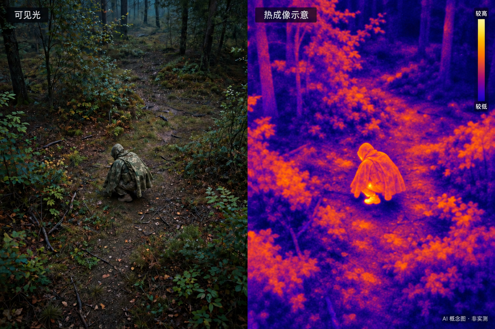
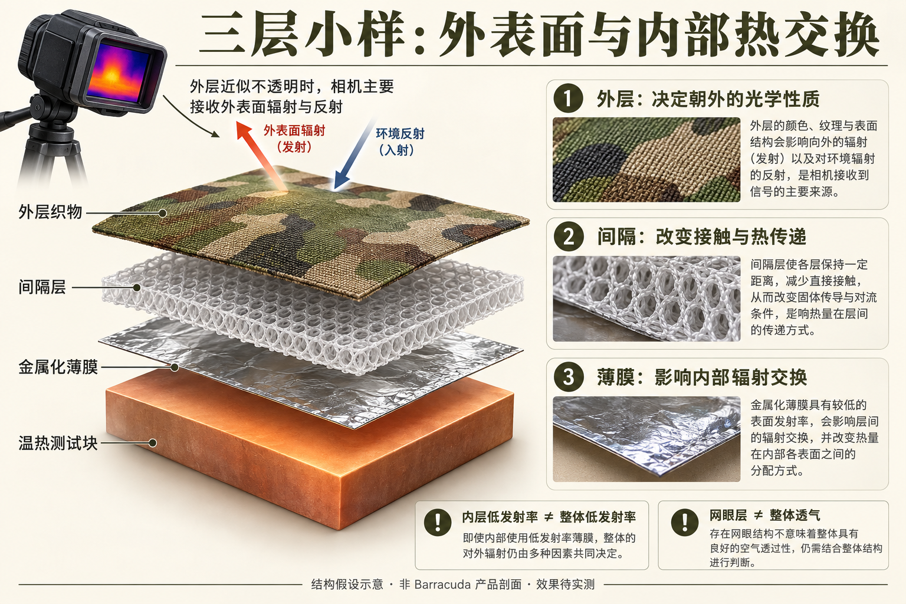
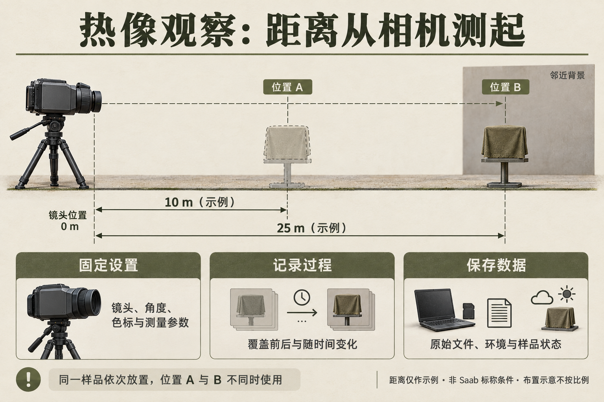

今天看到一条关于 Saab **Barracuda Poncho** 的新闻，第一反应是：这种看起来像雨披的东西，究竟怎样改变人在热像仪里的样子？如果从公开的材料和基本原理出发，能不能自己做一件斗篷，观察它在热成像下的表现？

这个念头和前面写的伪装遮障学习笔记接上了。可见光下，我们讨论颜色、纹理、边缘和背景；到了热红外，问题变成了表面温度、发射率、环境反射，以及这些因素怎样共同形成图像。

不过，在真正动手之前，需要先把“新闻里的产品”和“我设想的实验”分清楚。本篇记录的是查资料后形成的原理理解和自制计划，**目前还没有实物测试结果，也没有掌握 Barracuda 的材料配方**。

*题图为 AI 概念插图：左侧呈现可见光外观，右侧模拟热像仪的伪彩显示。色标仅表达示意中的相对辐射高低，没有真实的温度或辐射数据；人物与背景的颜色分布不代表这类斗篷的实测表现，不能用于判断伪装效果。*

## 1. 新闻里究竟说了什么？

我今天读到的 [Defence Industry Europe 报道](https://defence-industry.eu/saab-unveils-barracuda-poncho-camouflage-system-designed-to-protect-soldiers-from-thermal-and-uav-detection/)发表于 **2026 年 5 月 11 日**，所以这是今天看到的新闻，并非今天发布的新品消息。对照 [Saab 同日的官方新闻稿](https://www.saab.com/newsroom/press-releases/2026/saab-reveals-barracuda-poncho--camouflage-protection-for-soldiers)，能确认的主要信息是：它面向单兵，采用可翻面的昼夜设计，强调轻量、穿戴便利和活动自由，夜间构型提供增强的热防护。

进一步查看 [官方产品页](https://www.saab.com/products/barracuda-poncho)，林地和石质荒漠型号标注重量为 1.1 kg，尺寸为 140 × 255 cm。页面将可见光、近红外、短波红外和热红外列入防护范围；北极型号另有紫外防护。

这些信息让我感兴趣的地方，是它把多个波段的外观管理放进了一件可穿戴装备里。但官方列出的功能范围，不能直接换算成某种距离下的发现概率，也不能说明普通材料拼出来的斗篷能达到同样表现。

另外，“防无人机”容易让人误会成一种单独的材料性能。无人机是传感器的载体，它可能搭载可见光相机、热像仪或其他设备。真正需要讨论的是：**面对哪种传感器、哪个波段、什么观察条件，目标的哪些线索发生了变化？**

## 2. “防红外”这个说法太宽了

我最初把设想叫作“防红外斗篷”，但红外不是一种统一的成像机制。

近红外和短波红外图像，在很多场景里主要体现材料对入射光的反射；常见长波热像仪则主要利用物体及环境的热辐射成像。两者对材料提出的问题不同：肉眼看到相似的绿色，不代表近红外反射相似；可见光下不透明，也不能据此判定所有红外波段都不透过。[FLIR 红外成像介绍](https://www.flir.com/discover/what-is-infrared/)、[FLIR 关于材料透过性的说明](https://www.flir.com/de-de/discover/home-outdoor/can-thermal-imaging-see-through-walls/)

因此，第一阶段我想研究的范围应当收窄为：**在所用热像仪的工作波段内，材料怎样改变一个温热物体相对于背景的成像表现。** 等确定设备型号后，再记录它的光谱范围，而不是预先把所有热像仪都当成同一种设备。

这也意味着，买一块迷彩布，并不等于同时解决可见光、近红外和热红外三个问题。每个波段都需要相应的证据。

## 3. 热像仪看到的，为什么不等于真实温度？

初稿里，我曾把原理概括成“镀铝膜把人体热辐射反射回去，热像仪就只看见接近环境温度的布”。这个说法省略了很关键的一部分：**低发射率表面也会反射环境的红外辐射。**

对于在相机工作波段内近似不透明的表面，暂时忽略大气路径影响，可以用下面的简化关系理解到达相机的辐射：

$$
L_{\mathrm{cam}}\approx\varepsilon L_{\mathrm{bb}}(T_s)
+(1-\varepsilon)L_{\mathrm{env}}
$$

其中，$T_s$ 是表面的真实温度，$\varepsilon$ 是该波段内的有效发射率，$L_{\mathrm{bb}}(T_s)$ 是对应温度的黑体辐射，$L_{\mathrm{env}}$ 是被表面反射到相机方向的环境辐射。它不一定等于画面里紧挨着目标的背景辐射；镜面反射还会随朝向明显变化。

这只是用于建立直觉的模型。实际材料可能有透射，发射率也可能随波长和角度变化，远距离测量还要考虑大气吸收与路径辐射。FLIR 的测温说明强调，低发射率物体的读数尤其依赖反射表观温度设置。[FLIR 测温文档](https://docs.flir.com/T810605/en-US/latest/s10.html)

### 3.1 低发射率，不意味着自动融入背景

一块亮金属表面，自身温度可能不低，但如果主要反射较冷的环境辐射，热像上就可能显得冷。换一个角度，反射到附近的热源，它又可能显得热。FLIR 用金属表面的案例说明了这种现象：相机读到的变化，可能来自反射，而非物体本身升温或降温。[FLIR：发射率如何影响热成像](https://www.flir.com/en-asia/discover/professional-tools/how-does-emissivity-affect-thermal-imaging/)

所以我不能把“画面里变冷了”直接写成“伪装成功了”。如果背景较暖，一块异常的冷斑也可能很突出。更值得关注的是它与背景的差异是否减小，以及这种变化能否在时间和视角改变后保持。

### 3.2 隔热也不能让热量消失

材料覆盖温热物体之后，传导、对流和辐射仍然同时存在。隔热层可能减缓外表面温度的变化，但内部热量会积累，并通过其他路径散出。褶皱压实、接触位置变化、风和水分，也都会改变热交换。

于是，刚覆盖时的一张照片只能说明那个时刻的状态。要理解材料的作用，还需要观察覆盖一段时间之后发生了什么。

## 4. 我原先的“三层结构”，有一个漏洞

初稿设想的组合是：**外层迷彩布 + 中间网眼间隔层 + 内层镀铝膜**。这个构想看起来兼顾外观、隔热和低发射率，但有一处不能跳过：相机面对的是最外侧的材料。

*图 1：三层小样概念图。在外层织物于相机工作波段内近似不透明的条件下，相机主要接收外表面的辐射与环境反射。图中的层间距离为示意，金属化薄膜的实际发射率仍需结合表面状态测定；这不是 Barracuda 产品剖面，也不表示已验证的伪装效果。*

如果外层迷彩布在相机波段内近似不透明，相机主要接收到的是这层布的辐射与反射。内层镀铝膜的低发射率，不能直接当成整个组合朝外的发射率。它可以通过改变内部热交换，间接影响外层温度，但那是另一个需要测量的问题。FLIR 对不同材料成像的介绍也表明，能否看到后面的物体取决于材料在相应波段的透过性。[FLIR 材料透过性说明](https://www.flir.com/de-de/discover/home-outdoor/can-thermal-imaging-see-through-walls/)

同样，网眼布有孔，也不意味着整个层合结构透气。如果旁边是一张连续的不透气膜，不能只凭网眼层就宣称水汽能够穿过整个系统。

因此，“三层”适合作为我想研究的一个结构假设，不能写成已经反推出的 Barracuda 架构。目前查阅的官方新闻稿和产品页，没有给出足以复现其层合结构、涂层和工艺的资料。重绘后的示意图用于区分各层的作用与待验证问题，不能代替材料测量。

这个修正反而让问题更明确了：**每增加一层，它改变的是外表面光学性质，还是内部热传递？两种作用能不能分别观察？**

## 5. 先做材料小样，再考虑斗篷

我仍然想做一件斗篷，但第一步更适合从平面小样开始。整件穿戴样品会同时引入尺寸、褶皱、接触、姿态和人体活动等变量，很容易拍到了差异，却说不清差异从哪里来。

初步想观察的材料包括普通织物、金属化薄膜，以及用于保持间隔的材料。这里把它们视作实验样品，不预设哪种组合最好。

| 样品类别 | 想回答的问题 | 需要记录的材料信息 |
| --- | --- | --- |
| 普通织物 | 作为覆盖对照，外表面怎样随时间变化？ | 材质、厚度、涂层及干湿状态 |
| 金属化薄膜 | 图像变化有多少来自表面反射？ | 金属化面位置、保护层及表面状态 |
| 间隔材料 | 接触与间隔改变后，温度变化过程有何不同？ | 厚度、压缩情况及接触方式 |
| 覆盖后的组合 | 外层是否改变了原本的成像表现？ | 层序、固定方式及朝向 |

“防辐射布”“隔热膜”之类商品名称，不足以证明其热红外性能；“银色”也不能直接对应一个固定的发射率。保护层、涂层和表面状态都可能改变相机看到的结果。没有相应测试资料时，我会把这些参数记作未知，而不是沿用一个看起来很漂亮的数值。

材料费和制作时间也先不写成确定值。小样验证后再决定用料，比一开始买齐整件斗篷的材料更合理。

### 5.1 网上能找到哪些备选材料？

为了让这个计划有一个实际的起点，我又查了一轮在售材料。下面列的是**用于材料对照的小样候选**，每一项都对应一个想观察的变量。采购时可以在淘宝、京东或 1688 用表中的关键词检索，再向卖家核对规格；链接给出的是查到的产品或资料示例，不代表不同店铺的同名材料具有相同性能。

| 候选材料 | 国内采购关键词 | 适合观察什么？ | 下单前核对什么？ |
| --- | --- | --- | --- |
| 普通厨房铝箔 | `食品级铝箔纸 无涂层`、`加厚铝箔` | 作为金属表面对照，观察朝向、褶皱和覆盖后的图像变化。可参考 [Reynolds 普通加厚铝箔](https://www.reynoldsbrands.com/products/aluminum-foil/heavy-duty-foil)。 | 是否带不粘涂层、印刷或背胶；厚度与表面状态。普通铝箔和涂层铝箔应分开编号。 |
| 应急保温毯／救生毯 | `PET 镀铝 急救毯`、`户外保温毯 金银双面` | 观察现成金属化柔性材料的表现，可作为单独一类成品样品。参考 [迪卡侬保温毯产品页](https://www.decathlon.co.uk/p/survival-blanket/_/R-p-12837/)及[材料说明](https://cdn.decathlon-share.com/product-user-guide/b12c649e3c454/en_89099_usg_web_2024-04-25_en.pdf)。 | 实际基材、两面涂层、厚度和使用说明；金面、银面分别记录，不凭颜色推定发射率。 |
| 金属化 PET 薄膜 | `VMPET 镀铝膜 样品`、`PET 真空镀铝膜 12微米` | 作为与成品保温毯不同来源的薄膜样品，观察表面层与朝向的影响。网上有 [12 μm 金属化 PET 膜商品示例](https://www.alibaba.com/product-introduction/12-Micron-Aluminized-Mylar-MPET-Film_1600091034594.html)。 | 是否能买小样；哪一面金属化、是否有保护层。12 μm 是检索规格示例，不是热红外效果最佳厚度。 |
| 铝箔胶带 | `纯铝箔胶带 非镀铝 背胶`、`3M 425 铝箔胶带` | 作为“金属箔＋胶层”对照，研究固定方式和接触条件的影响；适合固定在测试基板上。参考 [3M 425 技术资料](https://multimedia.3m.com/mws/media/2366321O/3m-aluminum-foil-tape-425.pdf)。 | 真铝箔还是金属化塑料膜、胶层类型、箔厚与总厚。带胶样品不能当成裸箔的完全等价替代。 |
| 三维间隔网布／三明治网眼布 | `3D 三明治网眼布 3mm 样品`、`间隔织物 按米` | 观察加入间隔层前后的接触与温度变化过程。参考 [Ripstop by the Roll 的 1/8 英寸间隔网布](https://ripstopbytheroll.com/products/3d-spacer-mesh-1-8)，约为 3.2 mm。 | 是否是真正有厚度的间隔织物，而非单层网纱；克重、受压厚度和回弹情况。厚度仅作候选规格。 |
| PU 涂层尼龙／涤纶织物 | `PU 涂层 尼龙格子布 小样`、`涤纶牛津布 PU 背涂` | 作为外层覆盖候选，与现有未涂层织物比较。参考 [70D PU 涂层尼龙](https://ripstopbytheroll.com/products/1-9-oz-pu-coated-ripstop-nylon)。 | 纤维材质、克重、涂层位于哪一面，以及是否另有泼水处理；防水参数不能替代红外光学参数。 |

这些材料里，有几处尤其值得在采购时问清楚。

**首先，“镀铝膜”和“铝箔复合膜”要分开。** 搜索结果可能同时出现 VMPET、PET/AL/PE 等名称。例如，[PET/AL/PE 包装膜商品页](https://www.alibaba.com/product-detail/PET-Aluminum-PE-Foil-Film-Good_1601279740127.html)列出的是复合包装材料。不能只看外观就认定它与单独的金属化 PET 膜层结构相同；应该请卖家提供从朝外一面到背面的材料顺序，并记下相机实际面对哪一层。

**其次，厚度、克重和销售单位都要记录。** 网布厚度不能代表整件样品的重量，布料的 `D` 数也不是克重。按米出售时还要核对幅宽；有些国外网布页面按英尺计价，不能直接和国内每米报价比较。小样阶段优先找可零售、可提供规格说明的材料，不必为了一个实验购买整卷。

**最后，成品说明书也属于实验条件。** 例如，迪卡侬所列保温毯含 PET、铝和树脂，其说明书要求不要裁剪或撕破。因此，这款成品应保留完整状态进行固定观察；如果需要裁切小样，应另选允许加工的原材料，不能因为两者都叫“镀铝材料”就忽略差别。[迪卡侬保温毯使用说明](https://cdn.decathlon-share.com/product-user-guide/b12c649e3c454/en_89099_usg_web_2024-04-25_en.pdf)

### 5.2 第一批我想怎么选？

第一批可以先从**现有未涂层织物、普通无涂层铝箔、一份来源明确的金属化薄膜小样，以及一份间隔网布**开始。它们分别提供覆盖、金属表面、柔性金属化材料和间隔结构的对照。PU 涂层织物、保温毯和带胶铝箔可以作为后续补充，不需要一次买齐。

这份清单是我的选样思路，尚未证明哪一种组合更好。收货后先保存商品规格、包装标识和样品照片，再编号记录层序、朝向与表面状态。价格、库存、起订量和运费以下单时为准；这里保留检索词和规格核对项，方便之后复查材料来源。

## 6. 怎样让测试结果有解释力？

如果能借用热像仪，我会先围绕一个可重复的温热物体做材料观察，再考虑穿戴体验。优先回答三个问题：覆盖前后图像怎样变化，变化能维持多久，换一个观察方向后是否仍然成立。

*图 2：热像观察布置图。位置 A、B 是同一样品的两次放置，虚线样品仅表示另一位置，实际不同时摆放。10 m、25 m 均从镜头位置测起，仅用于说明距离记录方式；具体距离需按设备与实验问题选择，不是 Saab 标称条件。图示不按比例，也不包含实验结果。*

### 6.1 先固定成像条件

每次对比都记录设备型号、镜头、工作波段、距离、角度、环境条件和相机测量设置。保存原始辐射数据或设备支持的测量文件，尽量避免只留下伪彩图截图。

展示对比时，使用一致的调色板和显示温度范围。自动色标可能把不同辐射范围都映射成鲜明的颜色差异，单看两张截图的颜色深浅，容易误判变化。

这里还要区分两个目的：若比较同一相机下的**表观成像差异**，需要一致的处理方式；若测量材料的**真实表面温度**，则需要适合该材料的发射率、反射条件等校正，必要时辅以接触式温度测量。统一设置不等于所有材料都得到了准确测温。[FLIR 热成像测量技术说明](https://support.flir.com/DSDownload/Assets/T810442-en-US_A4.pdf)

### 6.2 温差可以记录，但不能当通用合格线

初稿提出用目标与邻近背景的平均表观温差评价效果，这个量可以保留：

$$
\Delta T_{\mathrm{app}}
=\left|\overline{T}_{\mathrm{target,app}}
-\overline{T}_{\mathrm{background,app}}\right|
$$

下标 $\mathrm{app}$ 强调它是相机在指定设置下给出的表观温度。背景区域的选择方式也要记录，否则换一个背景框就可能改变结果。

但“低于 1°C 优秀、超过 3°C 无效”这样的分级没有通用依据。目标尺寸、像素覆盖、设备性能、背景波动和观察任务都会影响解释。平均值接近，也可能掩盖局部热点、冷斑或明显边缘。

因此，我会同时查看区域内的分布、局部异常和随时间的变化。如果将来要讨论发现或识别效果，还需要额外设计观察任务；一个平均温差不能直接替代发现概率。

### 6.3 留下时间过程和重复记录

与其挑一张最好看的图，不如从覆盖前开始，记录覆盖后的连续变化，并在相近条件下重复。每次只改变一个主要因素，再逐步加入接触、朝向、风或日照等变化，才能判断原先的解释是否站得住。

| 记录项 | 内容 |
| --- | --- |
| 样品 | 编号、层序、朝向、干湿及表面状态 |
| 热源与接触 | 初始状态、接触方式、覆盖时间 |
| 相机 | 型号、波段、镜头、距离、角度、测量及显示设置 |
| 环境 | 气温、背景类型、风、日照和附近反射源 |
| 结果 | 原始文件、区域选择、表观温差及局部异常 |
| 重复情况 | 次数、顺序、偏差与可能原因 |

初稿使用的 10 m、25 m，也不能写成 Saab 的通用标称测试距离。就本次查阅的官方页面而言，没有找到支持这个说法的测试条件。具体距离应由设备分辨能力和实验问题决定，并在记录里说明。

## 7. 想做成穿戴样品，还要面对什么？

平面小样出现有意思的结果之后，距离一件能穿的斗篷仍有不少问题：重量、收纳体积、摩擦声、耐折性、潮湿后的状态，以及穿戴时结构是否还能保持。

尤其是散热和舒适性。人体持续产热，覆盖材料又可能影响蒸发和对流，不能从一张热像图判断穿戴是否合适，也不能给所有环境和人都套一个固定的“安全穿戴分钟数”。穿戴观察应在舒适环境下进行，保持容易脱卸；出现闷热或不适就停止。

我也不会从金属化材料的导电性，直接推导它具有雷达伪装能力。电磁响应取决于频率、结构、角度和整个系统，超出了这篇热成像小样计划能够验证的范围。

真正让我想继续做下去的，是这条新闻把一个抽象问题变得具体了：同样覆盖一层材料，为什么有时显得更热，有时显得更冷，换了外层或视角又为什么改变？

今天先把这些问题写清楚。下一步如果能拿到材料和设备，我想先回答一个很小的问题：**在明确记录的条件下，一块材料对温热物体的热像表现产生了什么变化，这个变化能否重复？** 等有了真实数据，再决定怎样把它推进到斗篷样品。

## 视频版本

根据本文内容生成了两个视频版本，也可以通过视频回顾文章中的原理和实验设想：

::bilibili{bvid="BV1vhH76hEG4" title="ChatGPT 版：热红外伪装斗篷的原理与实验设想" p=1 preload="auto"}

::bilibili{bvid="BV1vhH76hEvD" title="Muse 版：热红外伪装斗篷的原理与实验设想" p=1 preload="auto"}

## 参考资料

1. [Defence Industry Europe：Barracuda Poncho 报道](https://defence-industry.eu/saab-unveils-barracuda-poncho-camouflage-system-designed-to-protect-soldiers-from-thermal-and-uav-detection/)，2026-05-11。本文的阅读起点。
2. [Saab：Barracuda Poncho 官方新闻稿](https://www.saab.com/newsroom/press-releases/2026/saab-reveals-barracuda-poncho--camouflage-protection-for-soldiers)，2026-05-11。
3. [Saab：Barracuda Poncho 产品页](https://www.saab.com/products/barracuda-poncho)。型号、尺寸、重量及官方列出的波段范围。
4. [FLIR：How Does Emissivity Affect Thermal Imaging?](https://www.flir.com/en-asia/discover/professional-tools/how-does-emissivity-affect-thermal-imaging/)。低发射率与环境反射。
5. [FLIR：Measuring temperatures](https://docs.flir.com/T810605/en-US/latest/s10.html)。测温参数及低发射率条件下的反射温度设置。
6. [FLIR：Thermographic measurement techniques](https://support.flir.com/DSDownload/Assets/T810442-en-US_A4.pdf)。发射率、反射表观温度及大气路径影响。
7. [FLIR：What is Infrared?](https://www.flir.com/discover/what-is-infrared/)；[材料透过性常见问题](https://www.flir.com/de-de/discover/home-outdoor/can-thermal-imaging-see-through-walls/)。红外成像与材料透过性的基础说明。

*资料查阅日期：2026-10-04。文中的小样组合与观察计划属于我的实验设想，尚未通过实测验证；题图和图 1、图 2 均为 AI 生成概念示意图，不是实物照片或实验结果。*
