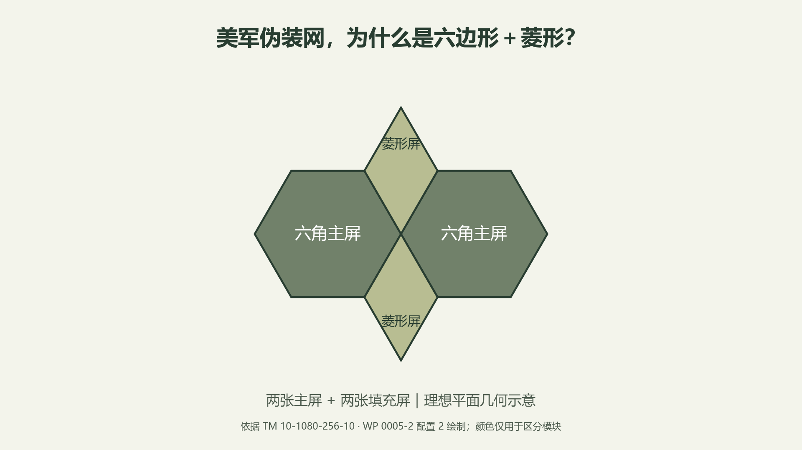
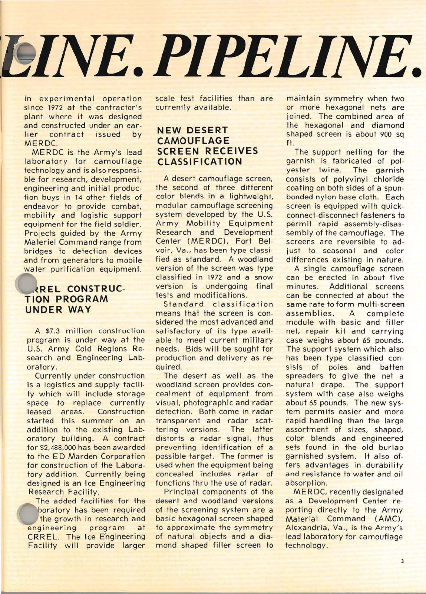
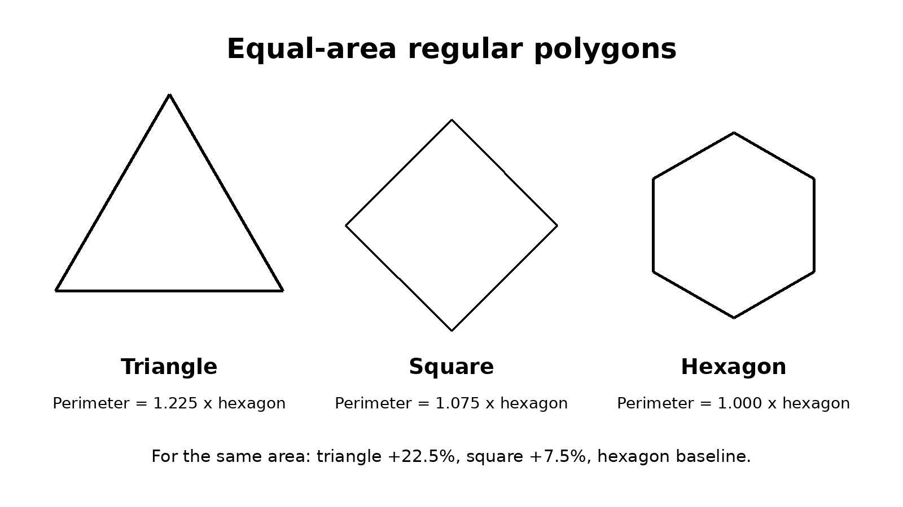
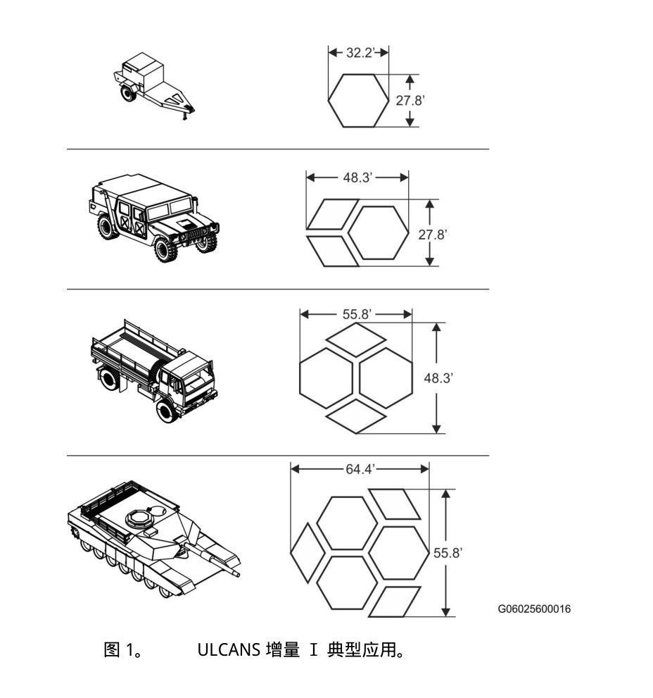
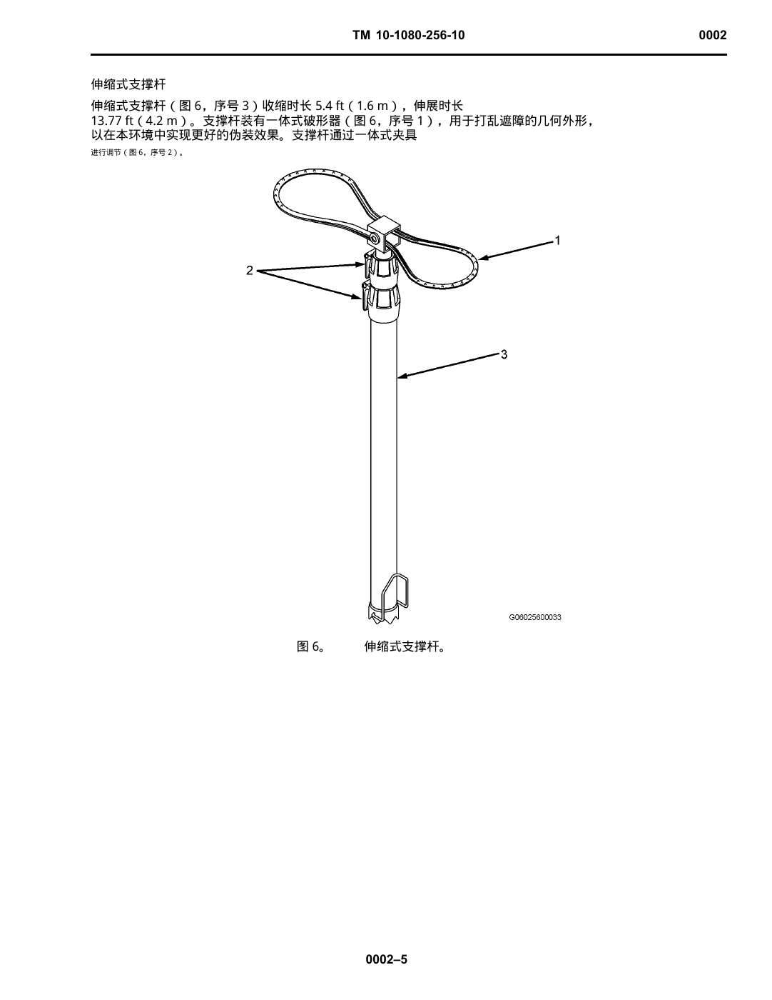
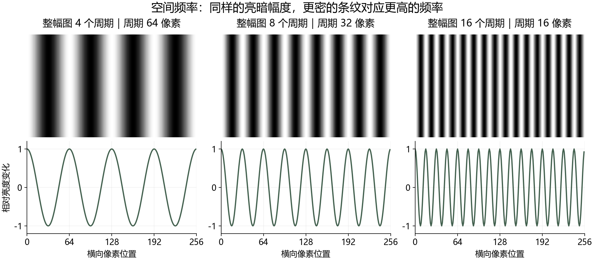
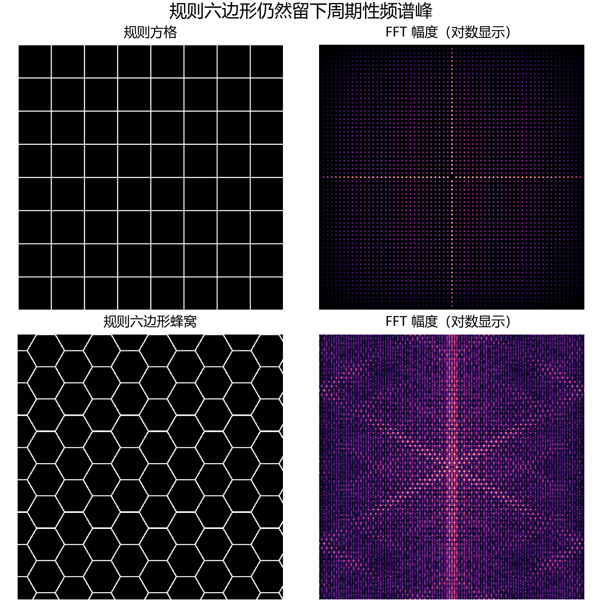
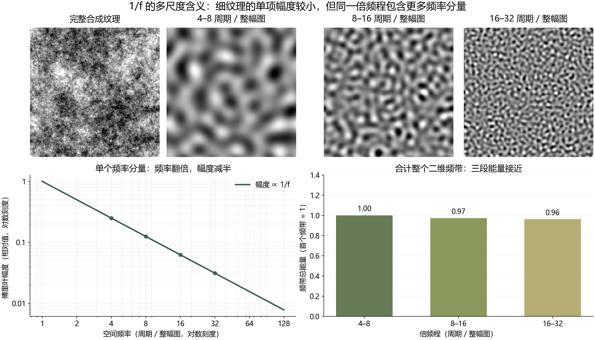

翻阅美军 ULCANS 伪装网手册时，我注意到它的一套标准网具包含**一张六角主屏和一张菱形屏**。这引出了一个问题：矩形网本来就能覆盖车辆、火炮和阵地，美军为什么采用了这种组合？正六边形已经能够密铺平面，额外的菱形又解决了什么问题？

这里讨论的是 ULCANS 这类通用静态遮障的标准网屏。美军还使用过个人覆盖网、车辆专用遮障等装备；其他国家也同时发展通用网具与车体覆盖系统。一个系统的模块外形，并不能概括一个国家全部伪装器材的形状。

1970 年代的原始报道记录了一次系统更新：美军采用轻型、可快速组合的标准遮障，改善旧式麻布饰装网的操作、保障和材料性能。六角主屏与菱形填充屏和合成材料、快速连接件、双面配色及支撑装置一起出现，后来的 LCSS、早期 ULCANS 和 ULCANS Increment I 延续了这种组合。

**旧式网具体系的更新，与矩形外形是否被淘汰，是两个不同问题。** 当年的资料说明通用模块可以承担原先需要专用网具的任务，却没有给出所有矩形网退出使用的时间表。系统换代的背景较明确，六角形与矩形之间的最终选型过程则尚未完整恢复。

当年的报道将外形设计意图概括为接近自然物体的形态；手册则显示，**六角主屏负责主体覆盖，菱形屏补齐组合间的空缺、延伸边界，支撑装置把平面网片架成具有起伏和垂落的遮障。** 这些资料说明了设计目标与使用方式。为什么这一组合最终胜过其他候选外形，以及相同条件下是否比矩形更难被发现，仍缺少直接比较资料。

2016 年陆军为下一代 ULCANS 征求方案时，甚至明确接受矩形及其他外形，重点要求模块可扩展、覆盖灵活。这份公告提供了一个重要参照：六角形与菱形是已经采用的具体方案，模块组织和隐蔽性能才是研制所要满足的要求。本文先追溯这套组合的形成与用途，再单独讨论 $1/f$ 在纹理分析中的位置。

*题图：依据 TM 10-1080-256-10、WP 0005-2 配置 2 绘制的平面组合。颜色用于区分模块。*

## 1. 转型的起点：旧网的问题不止是外形

### 按目标准备网具，按背景进行饰装

二战时期的美军伪装手册，已经重视轮廓、阴影、颜色与背景的关系。1944 年 FM 5-20A 展示了方形、矩形网具的多种用法，例如用一张 15 × 15 英尺的饰装网架设机枪阵地的平顶遮障。网面还需要与周围植被衔接，在边缘控制饰装密度，并打乱射孔附近的阴影。[FM 5-20A，机枪平顶遮障与饰装示例](https://www.ibiblio.org/hyperwar/USA/ref/FM/PDFs/FM5-20A.PDF)

这种体系以具体目标和用途为出发点：目标的尺寸决定网具规格，麻布饰条和自然材料提供所需的颜色与纹理。不同装备、季节和地形，意味着不同尺寸、配色与配套装置的准备工作。

旧矩形网本身也能拼接。1967 年美国空军技术报告 *Camouflage Practices* 摘录的 MIL-N-11849B(1) 规定了八类网具组合，例如四张 36 × 44 英尺网组成 72 × 88 英尺的野战炮兵遮障，四张 29 × 29 英尺网组成另一种炮兵套件。转型前已经存在拼接能力，问题在于不同用途仍对应多种网片和专用组合。[Camouflage Practices，AFAPL-TR-67-138，第 86—87 页，DTIC 档案](https://archive.org/details/DTIC_AD0664346)

### 1970 年代：重新考虑伪装在机动战场上的位置

1973 年冬季号 *The Engineer* 对当时的状态作了直接描述：1960 年代对伪装重视不足，新装备生产有限，旧网又因使用或长期闲置而逐渐失去可用性。文章讨论的未来战场，则要求部队快速建立、撤收宿营地，并在无法保证制空权的条件下应对敌方观察。

由此，网具的评价包含了一个实际矛盾：架网、收网占用时间，部队又需要保持机动。文章提到陆军机动装备研究与发展中心（MERDC）正在试验轻型遮障系统，以塑料和尼龙材料替换麻布饰装的棉绳网；陆军的 MASSTER 试验机构也在部队演习中评估模块化网具、车辆涂装与新的使用方法。[The Engineer，Winter 1973，第 21、24 页](https://upload.wikimedia.org/wikipedia/commons/b/b4/Engineer-_The_professional_bulletin_for_Army_engineers_-_USACE-p16021coll8-2767.pdf)

这里已经能看到转型的前提：网具既要提供隐蔽，也要便于部队携行、反复部署和管理。

### 1975 年的报道，明确列出了新系统改进什么

1975 年秋季号 *The Engineer* 介绍 MERDC 的模块化遮障时，直接将它与旧麻布饰装系统比较：新系统操作更方便、更迅速，减少了旧系统中大量尺寸、形状、配色和专用套件带来的复杂性，同时提高耐久性以及抗水、油吸收能力。[The Engineer，Fall 1975，第 3 页](https://home.army.mil/wood/7217/8429/9084/Fall_1975.pdf)

这些改进对应的是一整套设计：

| 旧系统的使用与保障问题 | 新系统的组织方式 |
| --- | --- |
| 不同目标需要准备多种尺寸与专用套件 | 用标准主屏、填充屏组合不同覆盖范围 |
| 部署与撤收影响机动 | 设置快速连接件，并配套支撑杆和撑条 |
| 配色需要适应季节与地域 | 网屏双面可翻转 |
| 麻布饰装体系存在耐久与吸水等问题 | 使用合成材料的承力网和涂层饰装层 |
| 侦察范围扩展到摄影与雷达 | 提供雷达散射型和雷达透波型 |

*图 1：The Engineer，Fall 1975，印刷第 3 页。右栏下半部对比了新系统与旧麻布饰装系统的操作和材料性能。*

**六边形与菱形出现在这次标准化、轻型化和部署方式的改造中。** 这也解释了为什么仅比较两种平面轮廓，会遗漏采用新系统的主要背景。

同年 5—6 月号陆军研发杂志把这项变化说得更具体：模块结构使新网适用于过去需要专用网具的多种场合，每套包含一张六角网、一张菱形网及支撑组件。这篇报道已经使用 **Lightweight Camouflage Screen System（LCSS）** 的名称。GAO 后来的采购审查则记录，陆军在 **1972 年 4 月 6 日**授予 Brunswick 制造方法与技术合同，用于建立轻型合成伪装遮障的制造系统。新外形、材料和批量制造是在同一轮系统更新中落实的。[1975 年陆军研发杂志 5—6 月号，第 18 页](https://asc.army.mil/docs/pubs/alt/archives/1975/May-Jun_1975.PDF)、[GAO B-183947，1976 年 3 月 11 日](https://www.gao.gov/products/b-183947)

## 2. 六角主屏与菱形填充屏：设计说明与几何用途

### 当时的设计说明：自然形态与组合轮廓

*Army Research and Development Newsmagazine* 1975 年 7—8 月号记载：MERDC 的林地型模块化遮障在 **1972 年**完成标准型式分类，沙漠型在 1975 年完成分类，雪地型当时仍在测试和修改。

报道将六角主屏的设计意图表述为：

> shaped to approximate the symmetry of natural objects

即“形状用于近似自然物体的对称性”。菱形填充屏则用于两张或更多六角屏组合时，维持这种形态关系。报道同时给出快速连接、双面配色以及支撑杆和撑条的设计；支撑装置使网面形成自然垂落。[1975 年陆军研发杂志，第 4 页](https://asc.army.mil/docs/pubs/alt/archives/1975/Jul-Aug_1975.PDF)

这是一条直接涉及外形选型的历史说明：设计者希望主屏及其组合呈现接近自然物体的形态，菱形屏承担维持组合形态的作用。“自然物体的对称性”这个表述仍比较宽泛，原文没有进一步解释它指哪些物体，也没有列出六角形与矩形的比较试验。它确认了伪装形态这一设计目标，但尚未量化这种外形相对矩形的优势。

从模块几何看，六角主屏提供大面积覆盖和三组边方向，菱形屏提供较小的面积增量；两者配合，使标准网片能够组成不同长宽比例和边界形态。矩形模块也可以组合和破形，因此这些几何特点能够解释系统如何工作，不能单独证明它是伪装效果最优的外形。

### 六边形的工程特点：可密铺，等面积周长较短

正六边形的内角为 120°，三个这样的角可以在同一个顶点相接，恰好组成 360°，因此同形模块能够无缝密铺。

对于“由同一种正多边形沿完整边密铺平面”这一类方案，候选有正三角形、正方形和正六边形。覆盖面积相同时，三者的周长不同：

| 图形 | 相对周长，以正六边形为 1 | 边方向组数 |
| --- | --- | --- |
| 正三角形 | 1.225 | 3 |
| 正方形 | 1.075 | 2 |
| 正六边形 | 1.000 | 3 |

*图 2：等面积正多边形的周长比较。*

在这三种方案中，六边形用较短的边界围出相同面积；与等面积正方形相比，其周长约短 7%。这减少的是单张模块的边界长度，能为包边和连接设计提供便利，实际操作耗时还取决于接头数量与结构。它的三组边方向相差 60°，也为组合提供了斜向边界。矩形模块同样能够密铺，并便于按长宽尺寸裁制。

这些是几何性质的分析。现有历史报道没有把周长最小化列为选型依据，制造省料也不能仅由周长推出：六角形的裁切方式、布幅利用率和余料安排都要另算。

:::details[等面积周长的计算]

面积为 $A$ 的正 $n$ 边形，其周长为：

$$
P_n=2\sqrt{nA\tan\frac{\pi}{n}}
$$

固定 $A$ 后，代入 $n=3,4,6$，并以 $P_6$ 归一化，即得到表中的数值。实际制造成本还包含裁切损耗、连接件数量、材料和加工工艺。

:::

### 菱形的作用：更细的面积增量与边界调整

密铺处理的是无限平面；部队覆盖的是有长度、宽度和高度的有限目标。只使用六角主屏时，每增加一张，覆盖面积就增加一个大模块。菱形屏让系统可以用更小的增量延伸边界、填充组合中的凹口和调整长宽比例。

题图提供了一个具体例子：两张主屏角对角排列时，上下各留下一个楔形空缺；接入两张菱形屏后，空缺被补齐，各网片沿边连接成连续罩面。主屏负责铺开面积，填充屏处理主屏之间及其周围的局部覆盖。六角形能够单独密铺，并不意味着只用六角形就能经济地覆盖每一种有限目标。

在等边长的理想模型中，一个正六边形可以分成三个 60°／120° 菱形。设共同边长为 $s$：

$$
A_{\mathrm{hex}}=\frac{3\sqrt3}{2}s^2,
\qquad
A_{\mathrm{rhombus}}=\frac{\sqrt3}{2}s^2
$$

**一张菱形屏相当于三分之一张六角主屏的面积。** 手册中的单张面积也体现了这个关系：六角屏约 673.6 ft²（62.6 m²），菱形屏约 224.5 ft²（20.9 m²）。

例如，当一张主屏的覆盖范围不足时，可以先接入一张或两张菱形屏，逐步延伸到所需位置；对于更长的目标，再组合多张主屏及填充屏。手册给出的配置包括：

| 配置 | 六角屏 | 菱形屏 | 拼接平面面积 |
| --- | --- | --- | --- |
| 0A | 0 | 1 | 224.5 ft² |
| 1A | 1 | 0 | 673.6 ft² |
| 1B | 1 | 2 | 1122.6 ft² |
| 1C | 1 | 4 | 1571.7 ft² |
| 2 | 2 | 2 | 1796.2 ft² |

这也说明“一套携行模块中各有一张”与“部署时按什么比例使用”是两件事。菱形填充屏有自己的覆盖用途，组合时可以按需要重新分配。[TM 10-1080-256-10，WP 0005-1 至 0005-2](https://imlive.s3.amazonaws.com/Federal%20Government/ID228024160599479581644136026249681352612/Atttachment%200010%20ULCANS%20Increment%201.pdf)

*图 3：ULCANS Increment I 的典型应用。分开展示的模块轮廓用于说明组合关系。来源：TM 10-1080-256-10，WP 0005-1。*

## 3. 从规则网片到不规则遮障：架设改变了什么？

六角形和菱形的规则边缘方便连接，但架设完成后的遮障是一个三维曲面。覆盖车辆时，部分网面用于垂落，支撑点形成高低变化，褶皱和饰装层又改变局部阴影。因此，表中的平面面积转换为实际覆盖范围，还需要考虑目标高度和支撑位置。

1975 年系统已经用支撑杆和撑条控制网面的垂落。ULCANS Increment I 手册中的伸缩支撑杆进一步配有 **shape disruptor（一体式破形器）**，用于打乱遮障的几何形状，改善其与环境的融合。[TM 10-1080-256-10，WP 0002-5](https://imlive.s3.amazonaws.com/Federal%20Government/ID228024160599479581644136026249681352612/Atttachment%200010%20ULCANS%20Increment%201.pdf)

*图 4：ULCANS 的支撑杆与破形器。来源：TM 10-1080-256-10，WP 0002-5。*

FM 20-3 的 SHAPE 条款也指出，架起的伪装网在支撑点之间仍可能出现直边或平滑曲线，需要通过伪装与破形处理这些轮廓。[FM 20-3，第 3-26 条](https://www.globalsecurity.org/military/library/policy/army/fm/20-3/ch3.htm)

因此，这套系统在两个环节采用了不同要求：**连接时保持标准几何，架设时根据环境调整可见形态。** 对观察者而言，网面的颜色、饰片、起伏、轮廓和阴影共同构成了目标图像。即使两次使用完全相同的网片，其架设结果也可以不同。

## 4. 为什么这套几何沿用到了 ULCANS？

**LCSS（Lightweight Camouflage Screen System，轻型伪装遮障系统）**的后续手册继续采用六角屏、菱形屏和支撑系统，可以连接多张网屏覆盖指定目标或区域。[FM 20-3，LCSS 附录](https://www.globalsecurity.org/military/library/policy/army/fm/20-3/appc.htm)

随着系统使用范围和传感器威胁变化，后续研制又遇到新的问题。1992 年公开的超轻型伪装专利，将旧轻型网的不足归纳为重量、勾挂、金属连接环可能损伤装备，以及热红外和部分毫米波防护不足。它提出更轻、减少勾挂并改进光谱性能的材料与连接结构。这份技术文献显示，当时的更新需求已经深入到材料和加工层面。[EP0490467A2，技术背景与结构说明](https://patents.google.com/patent/EP0490467A2/en)

**早期 ULCANS 在 1990 年代已有供应记录。** Saab 的 2003 年新闻稿称，自 1997 年起向美国陆军供应 ULCANS；陆军 2001 年预算说明记载林地雷达散射型已在生产。2003 年的 TM 5-1080-250-12&P 包含六角屏、菱形屏和破形器，系统已经具有多光谱防护。[Saab 供应记录](https://www.saab.com/newsroom/press-releases/2003/saab-awarded-new-contracts-for-ultra-lightweight-camouflage-net-systems-products-from-the-u.s.-defense)、[陆军 FY2002 采购预算](https://www.asafm.army.mil/Portals/72/Documents/BudgetMaterial/2002/base%20budget/justification%20book/opa34.pdf)、[2003 年 ULCANS 手册](https://www.liberatedmanuals.com/TM-5-1080-250-12-and-P.pdf)

**ULCANS Increment I 是后续能力增量。** 陆军 2018 年启动竞争性原型研制时，目标是替换 1990 年代研发的旧林地、沙漠型号。2024 年产品资料列出的重点包括短波红外防护、雷达背景匹配、长波热红外性能改进，以及浅／深林地、雪地／高山、沙漠／城市变体。[陆军 2018 年项目报道](https://www.army.mil/article/206368/army_netting_modernized_camo)、[2024 年产品资料](https://www.peocscss.army.mil/assets/PM-FSS-Factbook-30JUL2024.pdf)

| 阶段 | 主要变化 | 模块外形 |
| --- | --- | --- |
| 旧麻布饰装网 | 按用途准备多种尺寸、配色和套件 | 方形、矩形等规格 |
| 1970 年代 MERDC 模块化遮障／后续 LCSS | 合成材料、标准组合、快速连接、雷达用途分类 | 六角主屏＋菱形填充屏 |
| 早期 ULCANS | 轻型化、使用性能与多光谱防护更新 | 延续六角屏＋菱形屏 |
| ULCANS Increment I | 适应新传感器与更多环境，改进光谱性能 | 延续六角屏＋菱形屏 |

几何的延续，使不同代际仍能以类似方式组织覆盖范围；新的光谱指标则由材料、表面结构和系统构型实现。从发展结果看，模块组织与光谱性能成为了两个可以分别更新的设计维度。

相似外形也不等于连接件可以直接通用。2003 年公开的接口专利介绍，LCSS 使用塑料支架与销钉，早期 ULCANS 改用绳环连接；该专利专门设计了两种接头之间的转接结构。这说明代际衔接还需要处理具体接口，外轮廓只是系统的一部分。[US6599649B2，技术背景及接口设计](https://patents.google.com/patent/US6599649B2/en)

### 2016 年研制公告：矩形仍是可接受的候选

2016 年 8 月 3 日，陆军 ACC-APG 的 Natick 采购部门为下一代 ULCANS 发布市场调研公告 **PM-FSS-ULCANS-RFI**。其中对网片组织提出两项明确要求：每套至少有两种不同大小的网屏，以便组合覆盖不同范围；形状必须支持模块化扩展，覆盖大型目标。

公告允许单张网采用**菱形、六角形、矩形或供应商提出的其他形状**，鼓励一套系统使用多种形状，并要求提供所提外形的用户反馈或性能资料。比较方案时考虑的因素包括多光谱隐蔽、模块化与使用便利、物理性能、用户接受程度、后勤需求及成本。[公告正文转载，网屏形状与评价因素条款](https://govtribe.com/opportunity/federal-contract-opportunity/ultra-lightweight-camouflage-netting-system-pmfssulcansrfi)、[SAM.gov 原公告登记](https://sam.gov/opp/4ee9fb80ce2c17542b4228629d52a204/view)

这是一份研制前的市场调研文件，并不代表矩形方案已经列装。但它明确表明，在这轮方案征集中，陆军允许通过不同形状满足系统要求。后来 Increment I 继续采用六角屏与菱形屏，是最终产品的延续选择；仅凭这个结果，还无法判断候选外形之间的性能排序。

截至 **2026 年 10 月 6 日**，本次查阅的公开官方资料尚未见 ULCANS Increment II 的立项、采购或列装记录。DLA 登记的现行 MIL-PRF-32575（2024 年 10 月 17 日）仍以 Increment I 为题。[DLA 性能规范登记](https://quicksearch.dla.mil/qsDocDetails.aspx?ident_number=285632)

Increment I 手册中的 **Type I／Type II** 则是用途分类，分别为雷达散射型和雷达透波型。Type II 用于需要保留相应通信或雷达功能的装备；这个编号与后续能力增量的名称不同。[TM 10-1080-256-10，WP 0004-1](https://imlive.s3.amazonaws.com/Federal%20Government/ID228024160599479581644136026249681352612/Atttachment%200010%20ULCANS%20Increment%201.pdf)

## 5. 一个国家并不只有一种网：美国、俄罗斯等国的对照

比较遮障形状，需要区分三个层次：**单张网片的平面外廓、拼接并架设后的整体形态，以及车辆专用覆盖系统的裁片外形。** 矩形网片可以架成有起伏的遮障，六角网片也可以组合成近似长方形的覆盖范围；车体覆盖系统则需要适应车身各部位及活动部件，不能仅用一种通用多边形描述。

### 美国：通用静态网具之外，还有个人网与车辆专用遮障

ULCANS Increment I 的制式网屏仍是六角主屏与菱形屏。但美军伪装器材的范围更广。2010 年陆军、海军陆战队联合伪装手册附录 E 列有 **5 × 8 英尺的个人伪装覆盖网**，这是矩形规格，服务于另一种覆盖尺度。[ATTP 3-34.39／MCRP 3-17.6A，附录 E](https://www.trngcmd.marines.mil/Portals/207/Docs/TBS/MCRP%203-17.6A%20Camouflage%20Concealment%20and%20Decoys.pdf)

车辆专用方案也已有使用记录。2017 年 AUSA 展会现场采访记载，Barracuda **Mobile Breakaway** 系统的 DAGOR 车辆版本已经开始交付美国特种作战司令部。它将随车伪装部分与静态网结合，停驻时展开覆盖，离开时可迅速脱离网具。这是一种围绕车辆和使用动作设计的专用遮障，报道没有给出裁片的完整平面形状。[AUSA，2017 年 10 月 9 日现场采访](https://www.ausa.org/news/ausa-2017-event-spotlights-soldier-protection)

另一条路线是贴合车体的 **MCS 随车伪装系统**。Saab 明确说明其由按车辆定制的面板组成。美军第 2 骑兵团于 2017 年在 Stryker 上进行首次野外评估，2024 年 Saab 的美国项目报道仍列有 MCS 试验活动。[MCS 面板结构说明](https://www.saab.com/newsroom/press-releases/2018/saabs-new-adjustable-camouflage-announced)、[2017 年美军评估](https://www.saab.com/newsroom/press-releases/2017/mobile-camouflage-system-in-use-by-the-u.s.-army-in-europe)、[2024 年美国试验活动](https://www.saab.com/markets/united-states/us-newsroom/stories/2024/saabs-barracuda-camouflage-on-the-move-in-the-us)

这些记录确认了美军采用或评估过多种遮障形态。不过，2010 年器材表、2017 年交付与 2024 年试验分别对应不同时间和状态，尚不足以形成 2026 年完整在役清单。目前能直接确认的通用静态 ULCANS 标准模块仍是六角屏与菱形屏；尚未查到另一套当前常规部队大型矩形通用网具的明确列装资料。

### 俄罗斯：矩形制式模块与车体覆盖系统并存

俄罗斯的矩形模块路线延续到了较新的制式网具。俄工程装备目录记载，**МКТ-4П（MKT-4P）与 МКТ-4С（MKT-4S）于 2006 年采用**，分别用于荒漠草原和雪地背景，均包含两幅 9 × 12 m 覆盖网。目录中的 MKT-2L 则由十二个 3 × 6 m 标准单元组成一幅 12 × 18 m 网。这些都是矩形模块组织，并且目录明确允许重组单元，调整遮障大小与构型。[俄工程装备目录第二册，印刷第 95—98、111—112 页，公开镜像](https://sprotyvg7.com.ua/wp-content/uploads/2023/12/Katalog_Sredstva_inzhenernogo_vooruzhenia_Kniga_2.pdf)

俄罗斯生产商当前目录仍提供 3 × 6 m 单元和 12 × 18 m 网具，说明这种规格仍有生产供应。目录销售状态与部队现役库存并不相同，不能据此确定每个型号在各部队的配备情况。[Фабрика МАКС 生产商目录](https://fabrikamax.ru/magazin/folder/maskirovochnye-seti-dlya-voennoj-tehniki)

同时，**Накидка（Nakidka）车体覆盖式伪装系统已有近期部队交付记录**。Rostec 于 2024 年 5 月 7 日公告，向俄国防部交付的新批次 BMP-3 配备了该系统。它属于安装在车辆上的覆盖装备，不能按通用网具的六角屏与菱形屏套件理解。[Rostec：BMP-3 与伪装覆盖系统交付公告](https://rostec.ru/media/pressrelease/rostekh-postavil-v-voyska-novuyu-partiyu-bmd-4m-i-bmp-3-s-nakidkami/)

### 其他国家：矩形仍在使用，六角组合也继续出现

波兰提供了一个有明确近期装备状态的对照。军方出版机构 *Polska Zbrojna* 在 **2026 年 8 月 20 日**采访 WITI 军事工程技术研究所时，说明在用的旧版 Berberys 采用矩形网，研发中的 **Berberys 3.0** 改为一张六角屏与两张菱形屏，以便根据装备、战术情况和地形重新组合；同时更新颜色、微斑块和表面褶皱。当时 3.0 原型及文件准备提交装备机构继续测试。[Polska Zbrojna：Berberys 3.0 研发访谈](https://www.polska-zbrojna.pl/home/articleshow/46968?t=Siatka-niewidka-dla-wojska)

厂商供货方案则更加多样：

| 供应商／系统 | 提供的形状 | 资料状态 |
| --- | --- | --- |
| 塞尔维亚 Mile Dragić | 3 × 6、6 × 12、12 × 18 m 矩形，以及六角形、菱形和目标定制外形 | 厂商目录；不等同于塞尔维亚军队全部在役规格 |
| 瑞典 Saab Barracuda ULCAS | 尺寸和形状可按客户要求定制 | 厂商产品资料；不代表瑞典军队统一采用某一外形 |

具体说明见 [Mile Dragić 产品页](https://armyequipment.com/products/camouflage/camouflage-nets/)与 [Saab ULCAS 产品页](https://www.saab.com/products/ulcas)。

这些对照说明，**矩形模块化网、六角形与菱形组合、车辆专用异形覆盖，可以在同一时期并存，也可以服务于同一国家的不同需求。** 六角屏与菱形屏并非多光谱伪装的必要条件，矩形网也没有因美军 ULCANS 的选型而整体退出军用。外形应放回具体系统的覆盖尺度、安装方式与使用要求中理解。

## 6. 外形改变究竟带来了什么？

史料记载的新系统目标，包括减少旧式专用网具的复杂性、改善使用性能，以及让遮障形态接近自然物体。六角主屏与菱形填充屏是实际采用的组织方式，但整套系统的改进并不等于六角外形相对矩形的独立优势。

对最初的问题，可以分别作答：

| 问题 | 资料支持的答案 |
| --- | --- |
| 为什么更新旧麻布饰装网体系？ | 报道明确列出旧网的规格与专用套件复杂、操作及材料性能需要改进；通用模块和配套装置用于适应多种目标。 |
| 是否淘汰了所有矩形网？ | 尚无这样的全面退出记录。新系统承担旧式专用网具的任务，与所有用途的矩形网退出使用，并非同一结论。 |
| 为什么最终是六角形＋菱形？ | 报道提出接近自然物体形态的设计意图，手册展示组合用途；尚未找到当年候选外形的完整比较与最终取舍依据。 |
| 这个设计有伪装考虑吗？ | 有。形态接近自然、自然垂落及架设破形都是明确目标。模块外形与支撑、饰装需要共同发挥作用。 |
| 是否证明比矩形网更难被发现？ | 尚未查到控制材料、饰装、覆盖面积与架设差异后的外形对照试验，无法给出这种性能排序。2016 年研制公告仍接受矩形候选。 |

六角形的斜边方向、菱形与主屏的面积比例，解释了这套组合如何调整覆盖范围；它们也为部署后的形态处理提供了条件。但旧矩形网已经能够拼接和垂落，今天的矩形模块也能配合支撑系统破形。**通用模块的使用收益，不能全部归因于六角轮廓；新材料的多光谱收益，也不能归因于多了两条边。**

因此，目前能确认的是一套兼顾覆盖、操作、保障和伪装形态的系统设计。尚未完整恢复的是当年候选外形的筛选过程，以及各外形在相同条件下的隐蔽效果差异。1975 年的说明确认了设计意图，后来的手册确认了使用方式，2016 年公告确认了研制时对其他形状的开放性。

## 7. 补充：1/f 分析的是纹理，怎样与网具发生联系？

前面的几何讨论回答的是“网怎样拼、覆盖多大范围”。图像频谱回答的是另一个问题：**架设后的遮障，在观察图像中留下了哪些大小和方向的亮暗变化？**

二者通过最终图像发生联系。网片外形、组合方式和支撑位置影响外轮廓与阴影；饰片、颜色和褶皱影响内部纹理。频谱同时包含这些结构的信息，但一个 $1/f$ 斜率无法决定模块应当有几条边。本文查到的外形设计说明和研制公告也没有把 $1/f$ 列为六角形与菱形配对的理由。下面讨论的是部署后图像的分析方法。

### 先理解空间频率：把“纹理有多粗”变成一个数

取一张宽 256 像素的图像。如果黑白条纹每 64 像素完成一次亮—暗—亮循环，整幅图有 4 个周期；周期缩短到 32 像素，整幅图就有 8 个周期。条纹越密，空间频率越高。

用像素表示时，频率为 $f=1/\lambda$，其中 $\lambda$ 是一个周期的像素长度。也可以用“周期／整幅图”表示。低频对应大范围的亮暗变化，高频对应较细的纹理。在实际照片中，这种尺度还取决于观察距离和成像分辨率。

*图 5：空间频率与条纹疏密。下方曲线是从上方图案取出的一条水平亮度剖面。*

### 傅里叶分解：图像由不同尺度和方向的波纹叠加

真实背景同时包含大面积明暗、枝干、叶片和细碎纹理。傅里叶分解将一幅图像表示为许多不同方向、不同频率的正弦波叠加。可以将其写成：

$$
I(x,y)=\mu+\sum_k a_k\cos\left[2\pi(f_{x,k}x+f_{y,k}y)+\phi_k\right]
$$

这里 $\mu$ 是平均亮度；$(f_{x,k},f_{y,k})$ 决定第 $k$ 个波纹的疏密与方向；$a_k$ 是它的幅度，表示该分量的亮暗变化有多强；$\phi_k$ 是相位，决定波纹的峰谷落在什么位置。

**幅度谱描述各种波纹有多强，相位描述它们怎样排列成具体结构。** 一片树林的照片与随机合成纹理可以具有接近的幅度分布，实际边缘和物体结构却相差很大。

规则方格与规则蜂窝，都有固定的重复间距，因而会在某些频率和方向上出现集中峰值。网格的外形改变了峰值排列，周期性仍然存在：

*图 6：合成周期网格及其二维 FFT 幅度谱。右侧采用去均值、二维 Hann 窗与对数幅度显示。*

这幅图比较的是**可见的周期图案**。实际六角网片的接缝是否显露成网格，需要看饰装、重叠、架设和成像条件。模块形状与图像中的重复纹理，是相互关联而又不同的变量。

### 1/f：高频分量逐渐减弱，而多个尺度共同存在

Burton 与 Moorhead、Field 在 1987 年的研究中发现，许多自然场景的图像幅度谱随空间频率升高而近似按反比下降。将二维频谱按相同半径汇总，可以考察不同空间尺度上的幅度分布，常用的近似形式为：

$$
M(f)\propto\frac{1}{f}
$$

它的直接含义是：频率从 $f$ 增加到 $2f$，代表性幅度降到约一半；增加到 $4f$，降到约四分之一。它描述的是一段频率范围中的连续分布，包含多个尺度的结构。[Burton 与 Moorhead（1987）](https://opg.optica.org/ao/abstract.cfm?uri=ao-26-1-157)、[Field（1987），频谱与倍频程分析](https://inc.ucsd.edu/~marni/Igert/Field_1987.pdf)

那么，高频幅度较小，为什么还说不同尺度都很重要？关键在于：**一个高频频带包含的二维频率分量，也更多。**

以各向同性的理想模型为例，每个频率分量的功率与幅度平方成正比，因此 $1/f$ 幅度对应 $1/f^2$ 功率密度。比较 $[f,2f]$ 与 $[2f,4f]$ 两个环带，后者的二维面积是前者的四倍，而对应分量的功率约为四分之一，两者相抵，频带总能量接近相同。

| 从一个倍频程移到下一个倍频程 | 变化 |
| --- | --- |
| 频率范围 | 整体翻倍 |
| 对应分量的幅度 | 约减半 |
| 对应分量的功率 | 约变为四分之一 |
| 二维频率环带面积 | 变为四倍 |
| 整个频带的总能量 | 近似保持相同 |

为观察这个关系，下图使用随机相位，在每幅图 1—128 个周期的范围内将幅度设为 $1/f$，合成一幅纹理，再提取三个倍频程。三个频带从粗到细，但各自的总能量接近；频带图采用统一的亮度范围，保留了这种幅度关系。

*图 7：512 × 512 像素合成纹理及其频带分解。以首个频带为 1，三个频带的能量约为 1.00、0.97、0.96；细小差异来自离散频率网格。*

:::details[二维倍频程能量的推导]

设二维功率谱密度近似各向同性，且 $S(f)=C/f^2$。半径为 $\rho$、厚度为 $d\rho$ 的频率环带面积是 $2\pi\rho\,d\rho$，因此：

$$
E_{[f,2f]}\propto\int_f^{2f}\frac{C}{\rho^2}\,2\pi\rho\,d\rho
=2\pi C\ln2
$$

结果与起始频率 $f$ 无关。反过来，如果在理想各向同性模型中要求各倍频程含有相同能量，就会得到这种功率密度分布。这是 $1/f$ 幅度谱与尺度不变性之间的联系。

此处的 $S(f)$ 是频率平面上单位面积的功率密度，沿环带积分后才得到频带总能量。信号处理中通常称为“粉红噪声”的 $1/f$ 指功率谱；本文自然图像分析中的 $1/f$ 指幅度谱。

:::

### 用它研究遮障时，比较的是观察图像与局部背景

树冠、枝条、叶片和地面阴影共同构成了背景的多尺度结构。$1/f$ 近似提供了一种统计描述：在一定尺度范围内，图像没有只由某一个粗细尺度主导。观察距离变化时，这些结构在图像中的尺度也随之改变。

对人工遮障而言，有价值的问题是：网面是否出现过强的固定间距，斑块和阴影是否集中在少数尺度，其颜色、方向与局部背景有多大差异。这些问题可以通过部署后的图像和背景图像比较。六角屏或矩形屏都可以搭配不同表面纹理，同一种外形也能产生不同的频谱。

自然图像的谱斜率本身也有变化。Tolhurst 等人在 1992 年分析 135 张自然照片，得到约 −0.8 至 −1.5 的拟合斜率，平均约 −1.2，约四分之一图像在双对数坐标中呈现明显曲率。[Tolhurst 等（1992）](https://pubmed.ncbi.nlm.nih.gov/1408179/)

因此，具体研究应比较当地背景在实际观察尺度下的统计特征，并同时考察相位、边缘、方向和颜色。$1/f$ 可以组织多尺度纹理的分析，却不足以单独预测发现率。它与六角屏、菱形屏的联系，落实在**组合与架设之后形成的轮廓、阴影和纹理**上。

## 参考资料

1. [FM 5-20A：Camouflage of Individuals and Infantry Weapons](https://www.ibiblio.org/hyperwar/USA/ref/FM/PDFs/FM5-20A.PDF)，1944 年。
2. [The Engineer，Winter 1973](https://upload.wikimedia.org/wikipedia/commons/b/b4/Engineer-_The_professional_bulletin_for_Army_engineers_-_USACE-p16021coll8-2767.pdf)，重点参考第 21、24 页的伪装需求与新材料试验讨论。
3. [The Engineer，Fall 1975](https://home.army.mil/wood/7217/8429/9084/Fall_1975.pdf)，第 3 页，新型沙漠模块化遮障与旧系统的比较。
4. [Army Research and Development Newsmagazine，July–August 1975](https://asc.army.mil/docs/pubs/alt/archives/1975/Jul-Aug_1975.PDF)，第 4 页，外形设计、型式分类与部署方式。
5. [TM 5-1080-250-12&P](https://www.liberatedmanuals.com/TM-5-1080-250-12-and-P.pdf)，2003 年，早期 ULCANS 操作维护手册。
6. [TM 10-1080-256-10](https://imlive.s3.amazonaws.com/Federal%20Government/ID228024160599479581644136026249681352612/Atttachment%200010%20ULCANS%20Increment%201.pdf)，2020 年，ULCANS Increment I 操作员手册，WP 0002、0005。
7. [PdM FSS Product Fact Book](https://www.peocscss.army.mil/assets/PM-FSS-Factbook-30JUL2024.pdf)，2024 年，ULCANS Increment I 条目。
8. [Polska Zbrojna：Siatka niewidka dla wojska](https://www.polska-zbrojna.pl/home/articleshow/46968?t=Siatka-niewidka-dla-wojska)，2026 年 8 月 20 日，Berberys 3.0 研发访谈。
9. [Field（1987）](https://inc.ucsd.edu/~marni/Igert/Field_1987.pdf)、[Burton 与 Moorhead（1987）](https://opg.optica.org/ao/abstract.cfm?uri=ao-26-1-157)、[Tolhurst 等（1992）](https://pubmed.ncbi.nlm.nih.gov/1408179/)，自然图像空间频谱研究。
10. [Camouflage Practices，AFAPL-TR-67-138](https://archive.org/details/DTIC_AD0664346)，1967 年，第 86—87 页，旧式棉绳网及专用拼接套件的规范摘要。
11. [Army Research and Development Newsmagazine，May–June 1975](https://asc.army.mil/docs/pubs/alt/archives/1975/May-Jun_1975.PDF)，第 18 页，LCSS 取代旧式专用网具与批量制造。
12. [GAO B-183947](https://www.gao.gov/products/b-183947)，1976 年，记载 1972 年制造系统合同与早期生产、测试过程。
13. [US6599649B2](https://patents.google.com/patent/US6599649B2/en)，2003 年，LCSS 与早期 ULCANS 的连接件及转接方案。
14. [PM-FSS-ULCANS-RFI 公告正文转载](https://govtribe.com/opportunity/federal-contract-opportunity/ultra-lightweight-camouflage-netting-system-pmfssulcansrfi)，2016 年 8 月 3 日，重点参考网屏形状与模块化要求；[SAM.gov 登记](https://sam.gov/opp/4ee9fb80ce2c17542b4228629d52a204/view)。
